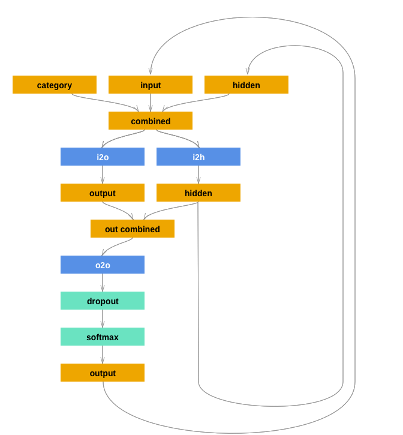

### Generation for user name relied on region

使用rnn生成不同地区人民，pytoch的一个官方教程，前几天跑了人名分类，发现char level 的rnn由于受到字符串长度的限制，跑的效率不高，不能适用大batch, 所以我想改一下，大概思路就是加mask和pad，让每个字符串batch都等长，浪费点内存无所谓，主要是可以快一点

### Network



```python
import torch
import torch.nn as nn

class RNN(nn.Module):
    def __init__(self, input_size, hidden_size, output_size):
        super(RNN, self).__init__()
        self.hidden_size = hidden_size

        self.i2h = nn.Linear(n_categories + input_size + hidden_size, hidden_size)
        self.i2o = nn.Linear(n_categories + input_size + hidden_size, output_size)
        self.o2o = nn.Linear(hidden_size + output_size, output_size)
        self.dropout = nn.Dropout(0.1)
        self.softmax = nn.LogSoftmax(dim=1)

    def forward(self, category, input, hidden):
        input_combined = torch.cat((category, input, hidden), 1)
        hidden = self.i2h(input_combined)
        output = self.i2o(input_combined)
        output_combined = torch.cat((hidden, output), 1)
        output = self.o2o(output_combined)
        output = self.dropout(output)
        output = self.softmax(output)
        return output, hidden

    def initHidden(self):
        return torch.zeros(1, self.hidden_size)
```

### pad & mask

```python
def inputTensor(line, length=20):
    tensor = torch.zeros(1,length,n_letters)
    mask = torch.zeros(1, length)
    for li in range(len(line)):
        letter = line[li]
        tensor[0][li][all_letters.find(letter)] = 1
        mask[0][li] = 1
    return tensor, mask

# LongTensor of second letter to end (EOS) for target


def targetTensor(line, length=20):
    letter_indexes = [all_letters.find(line[li]) for li in range(1, len(line))]
    letter_indexes.append(n_letters - 1)  # EOS
    pad = [n_letters-1]*(length - len(line))
    letter_indexes = [*letter_indexes, * pad]
    return torch.LongTensor(letter_indexes)[None, ...]
```


### Experimental

* 只改batch,貌似不是个好主意， length 也会限制，但是，rnn是单向的，有依赖。。。

  **那就没法再提升速度了**

  ```python
  	for i in range(input_line_tensor.size(1)):
          output, hidden = rnn(
              category_tensor[:, 0], input_line_tensor[:, i], hidden)
  
          #print(output.shape, target_line_tensor[:,i].squeeze(1))
          l = criterion(output, target_line_tensor[:, i].squeeze(1))
          loss += (l*mask_tensor[:, i]).sum() / 2000
      loss.backward()
      for p in rnn.parameters():
          p.data.add_(p.grad.data, alpha=-learning_rate)
  ```

```txt
0m 9s (5000 5%) 2.7826
0m 19s (10000 10%) 3.2214
0m 29s (15000 15%) 2.9693
0m 39s (20000 20%) 2.7921
0m 48s (25000 25%) 2.7021
0m 58s (30000 30%) 2.8153
1m 7s (35000 35%) 2.4852
1m 16s (40000 40%) 2.0252
1m 26s (45000 45%) 1.8827
1m 36s (50000 50%) 2.4484
1m 45s (55000 55%) 2.2230
1m 55s (60000 60%) 2.9437
2m 4s (65000 65%) 1.8821
2m 14s (70000 70%) 1.5707
2m 24s (75000 75%) 2.3387
2m 33s (80000 80%) 1.8031
2m 43s (85000 85%) 1.6756
2m 52s (90000 90%) 3.7836
3m 1s (95000 95%) 2.3291
3m 10s (100000 100%) 2.6496
```


