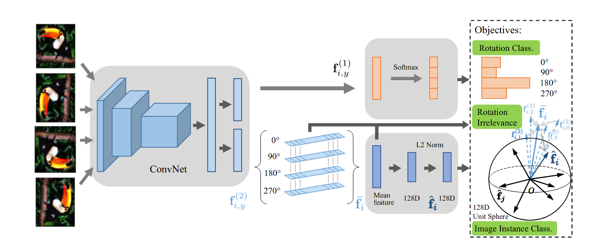

#### Self-Supervised Representation Learning by Rotation Feature Decoupling

本文提出特征解耦的思路来预训练神经网络

一个图片输入$X$, 经过数据增广 ${X, X_{90}, X_{180}, X_{270}}$, 神经网络将每个图片实例映射为$f = \{ f^1, f^2\}$, $f^1$ 向量被解耦用于旋转的预测，$f^2$ 向量为一个旋转无关的特征向量

#### 旋转预测

旋转相关的向量$f^1$, 被用来预测分类旋转的角度，但是有一个严重的问题，图片如果是有**严重的对称特征**，这个监督是无效的，也就是旋转之后没什么显著变化， 为了只有效监督明显旋转的图片， 文章中采用**权重估计**的办法

#### 旋转不变

旋转无关的向量$f^2$,通过监督使得不同旋转的特征向量都尽量接近
