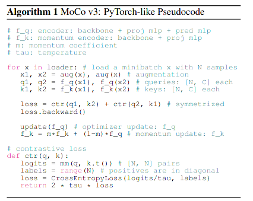
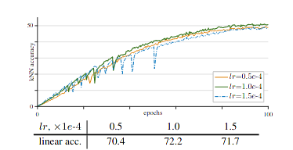
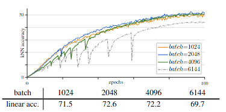
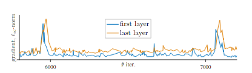
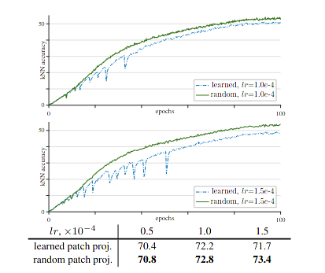
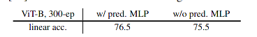
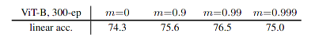
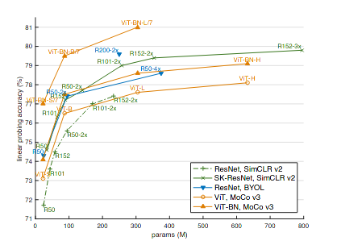

#### An Empirical Study of Training Self-Supervised Vision Transformer

self-supervised learning is derived from neural language process, which receives a vast attention from visual researcher, due to never need huge mount of annotated tags for train-data. As for visual transformer, there is a sufficient self-training strategy stolen from nlp, whose proxy objective function is reconstruct the masked patch, while this paper proposed a different approach based on contrastive learning that forces vit to find the most similar visual representation encoded by vit backbone.

### Basic Development

* **word2vec**

* **SimCLR**   [[link](https://wangsssssss.github.io/2021/08/02/SimCLR/)]

  propose a framework to self-supervise visual representation via contrastive learning, the representation is extracted from raw image through siamese neural nerwork

* **SimCLR-memory bank** [[link](https://wangsssssss.github.io/2021/08/10/SimSiam/)]

  due to the memory constraint of devices, the negative sample will not achieve a optimal or efficient stage, thus store the processed visual representation in a database, for a new image input, just sample negative sample from above mentioned database, this will efficiently improve the batchsize of learning

* **SimCLR-momentum encoder** [[link](https://wangsssssss.github.io/2021/08/10/SimSiam/)]

  the old or out of dated representation located in database if harmful to self-supervise of weight update, thus use momentum encoder to update weight of key encoder(which has a same architecture in terms of query encoder), and use queue to store visual representation.

* **SimSiam**  [[link](https://wangsssssss.github.io/2021/08/10/SimSiam/)]

  just use siamese neural network to self-supervise, without contrastive learning, the objective is to maxmize inner dot of representation of a image augmented by different ways. 

### Motivation

use contrastive learning instead of reconstruct approach to self-supervise ViT, and find **The instablity of self-supervise process harm the accuracy improvement **, then proposes novelty approach to help stable the training process.

**use**: contrastive learning,   momentum encoder

### Empirical Observations

#### Hidden unstable

* when increase batch size, the unstable becomes noticeable

* when increase learning rate, the unstable also becomes noticeable

  

      
      
  

  

#### A spike Delay

the gradient magnitude is delayed from first layer to last layer, Amazing!!!

#### Fixed random projection useful

use fixed random projection layer can stop the "dip" phenomenon 

### Result

this paper has employed prediction head , momentum encoder and fixed random projection layer, the ablation experiment shows they all play a vital role in accuracy improvement.

**I think maybe this process make the self supervise more asymmetric, maybe it is pivotal **

**remember: stop gradient , one side prediction head in simsiam make network asymmetric, and the momentum encoder also make the weight not symmetric **

* prediction head
* momentum encoder

    
    

result:

