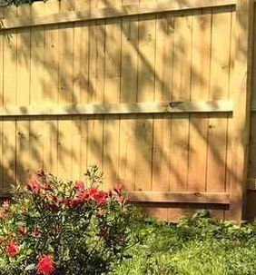

## sentences

*I don't want to get to the point in my life where I'm tied down from  family, from work, from whatever, and I didn't make the most of my youth*

*She also came to terms with her sexuality during quarantine and feels like she missed out on getting to explore that.* 

*Life is too short to not get drunk with your friends and life is too short to not try to find love?*

*Christakis also predicts a period of time where people are still dealing with the fallout of jobs lost, businesses closed, mourning loved ones  and more*

*thinks that her joy and grief will coexist. Although she says getting the vaccine lifted a huge weight off her shoulders.*

