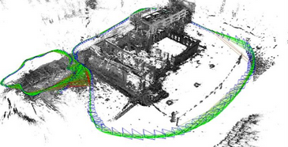

# 相似变换 Sim3



sim3 变换应用在视觉slam的回环检测计算中，目的是为了消除里程计在运行过程中累计的尺度漂移与误差，一般采用7DoF的表征方式，包含了尺度信息，旋转信息，位移信息

​												矩阵表示形式为：$sim3 = \left [ \begin{matrix} sR , t \\ 0, 1 \end{matrix}\right ]$

## sim3 的含义

已知$p_i , i=1,2,..n$是相机在$T_1$下观测$O_i$得到的像素坐标，经过三角化算法计算出来的坐标$P_i , i=1,2,..n$，经过一段时间的运动建图之后，$q_i , i=1,2,..n$是相机在$T_2$下观测$O_i$得到的像素坐标，经过三角化算法计算出来的坐标$Q_i , i=1,2,..n$，如果$P_i$与$Q_i$的位置差距很大，我们就知道了，这一段时间的运动简图过程存在了累计误差，现在就需要引入$sim3$来衡量$T_1$与$T_2$的相似变换。

## sim3 直接计算

**算法描述：**

sim3 是7自由度，也就是最多七个变量，求解过程最少需要使用3对三维坐标点，也就是九个方程，解7个变量，简述为已知 $\{ P11, P12, P13, P21, P22, P23 \}$, 第一个脚标为所在相机坐标系，第二个脚标为第几个点。

下面这块基本基于向量空间中的相似变换和基向量分解：

* 分别以第一个点为远点建立坐标系

  * 以第二个点方向为X轴
  * 通过正交化方法，计算出Y轴方向
  * 通过叉乘计算Z轴方向

* 得到两个新坐标系的单位向量矩阵$M1, M2$

  $M = [X, Y, Z]$ 

  $Pij$ 现在都可以由$Mi$来唯一表示

* 计算旋转矩阵

  $M2 = R M1$

  $R = M2*M1^T$

求解平移：

* 计算每个坐标系下的质心，然后去除质心

  得到 $\{ \bar P11, \bar P12,\bar P13,\bar P21,\bar P22,\bar P23 \}$

* 根据$ P2i= sR*  P1i + t$，最小化目标函数为：

   $min \Sigma || P2i - sR * P1i + t ||^2$

  根据最小二乘法可以得到：

  $t = \bar P2 - sR * \bar P1$

求解尺度变换：

求解sim3旋转：

**代码示例：**

```c++
void Sim3Solver::computeT(cv::Mat &P1, cv::Mat &P2)
{
    // Custom implementation of:
    // Horn 1987, Closed-form solution of absolute orientataion using unit quaternions

    // Step 1: Centroid and relative coordinates

    cv::Mat Pr1(P1.size(),P1.type()); // Relative coordinates to centroid (set 1)
    cv::Mat Pr2(P2.size(),P2.type()); // Relative coordinates to centroid (set 2)
    cv::Mat O1(3,1,Pr1.type()); // Centroid of P1
    cv::Mat O2(3,1,Pr2.type()); // Centroid of P2

    centroid(P1,Pr1,O1);
    centroid(P2,Pr2,O2);

    // Step 2: Compute M matrix

    cv::Mat M = Pr2*Pr1.t();

    // Step 3: Compute N matrix

    double N11, N12, N13, N14, N22, N23, N24, N33, N34, N44;

    cv::Mat N(4,4,P1.type());

    N11 = M.at<float>(0,0)+M.at<float>(1,1)+M.at<float>(2,2);
    N12 = M.at<float>(1,2)-M.at<float>(2,1);
    N13 = M.at<float>(2,0)-M.at<float>(0,2);
    N14 = M.at<float>(0,1)-M.at<float>(1,0);
    N22 = M.at<float>(0,0)-M.at<float>(1,1)-M.at<float>(2,2);
    N23 = M.at<float>(0,1)+M.at<float>(1,0);
    N24 = M.at<float>(2,0)+M.at<float>(0,2);
    N33 = -M.at<float>(0,0)+M.at<float>(1,1)-M.at<float>(2,2);
    N34 = M.at<float>(1,2)+M.at<float>(2,1);
    N44 = -M.at<float>(0,0)-M.at<float>(1,1)+M.at<float>(2,2);

    N = (cv::Mat_<float>(4,4) << N11, N12, N13, N14,
                                 N12, N22, N23, N24,
                                 N13, N23, N33, N34,
                                 N14, N24, N34, N44);


    // Step 4: Eigenvector of the highest eigenvalue

    cv::Mat eval, evec;

    cv::eigen(N,eval,evec); //evec[0] is the quaternion of the desired rotation

    cv::Mat vec(1,3,evec.type());
    (evec.row(0).colRange(1,4)).copyTo(vec); //extract imaginary part of the quaternion (sin*axis)

    // Rotation angle. sin is the norm of the imaginary part, cos is the real part
    double ang=atan2(norm(vec),evec.at<float>(0,0));

    vec = 2*ang*vec/norm(vec); //Angle-axis representation. quaternion angle is the half

    mR12i.create(3,3,P1.type());

    cv::Rodrigues(vec,mR12i); // computes the rotation matrix from angle-axis

    // Step 5: Rotate set 2

    cv::Mat P3 = mR12i*Pr2;

    // Step 6: Scale

    double nom = Pr1.dot(P3);
    cv::Mat aux_P3(P3.size(),P3.type());
    aux_P3=P3;
    cv::pow(P3,2,aux_P3);
    double den = 0;

    for(int i=0; i<aux_P3.rows; i++)
    {
        for(int j=0; j<aux_P3.cols; j++)
        {
            den+=aux_P3.at<float>(i,j);
        }
    }

    ms12i = nom/den;

    // Step 7: Translation

    mt12i.create(1,3,P1.type());
    mt12i = O1 - ms12i*mR12i*O2;

    // Step 8: Transformation

    // Step 8.1 T12
    mT12i = cv::Mat::eye(4,4,P1.type());

    cv::Mat sR = ms12i*mR12i;

    sR.copyTo(mT12i.rowRange(0,3).colRange(0,3));
    mt12i.copyTo(mT12i.rowRange(0,3).col(3));

    // Step 8.2 T21

    mT21i = cv::Mat::eye(4,4,P1.type());

    cv::Mat sRinv = (1.0/ms12i)*mR12i.t();

    sRinv.copyTo(mT21i.rowRange(0,3).colRange(0,3));
    cv::Mat tinv = -sRinv*mt12i;
    tinv.copyTo(mT21i.rowRange(0,3).col(3));
}
```


## 图优化


