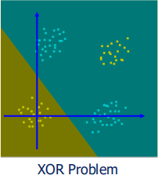
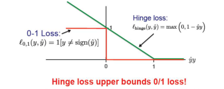
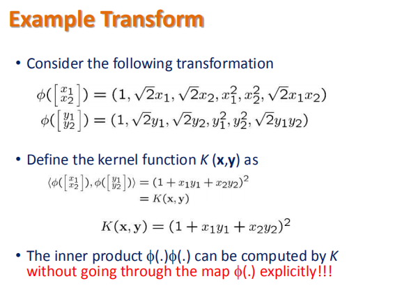

## the SVM question

Given training data $\{X_i, y_i\}$, $y_i \to \{-1, 1\}$this is a binary classification problem.

the constrain is $y_i(W X_i + b) > 0$,  also we can make the constrain greater, 

witch is :$y_i (WX_i +b) > 1$ , then the $WX_i +b > 1$

the target is to maxmize $(W X_i + b) / ||W||^2 $

then ${(W X_i+b )/ |W|^2 } \gt {1 / |W|^2}$

## the SVM math format

the question is rewrite as :

​								min ${1 \over 2}|W|^2$

given: 					$y_i (WX_i +b) > 1$ 

the soft svm question is rewrite as :

​								min ${1 \over 2}|W|^2 + C\Sigma \epsilon_i$ 

given: 					$y_i (WX_i +b) > 1 - \epsilon_i$ 

## the SVM loss function

​															$F_{hing}(y, \hat y) = max(0, 1-y\hat y) $

## the dual problem of SVM

the langrage problem is :

​				min ${1 \over 2}|W|^2 + \Sigma \lambda_i \{1 - y_i (WX_i +b)\} $

the derivative is 

​						$W - \Sigma \lambda_i y_iX_i = 0 $

​						$\Sigma \lambda_i y_i = 0$

​						$y_i (WX_i +b) = 1$

the dual problem is :

​			           max $\Sigma_i \lambda_i-\Sigma_i \Sigma_j (\lambda_i\lambda_jy_iy_jX_iX_j)$			

for the equation meaning, the langrage method convert the hard question to soft question,

the $\lambda $ indicate the hardness of the hard question, if $\lambda$ is bigger , the the constrain is harder.

## the kernal methods

using the $\phi$ to make the vector is better. 

​					max $\Sigma_i \lambda_i-\Sigma_i \Sigma_j (\lambda_i\lambda_jy_iy_j\phi (X_i)\phi(X_j)$	

but the compute of  $\phi(x_i) \phi(x_j)$ is not necessary

we can use $K(x_i, x_j) = \phi(x_i) \phi(x_j) = ....$to avoid the unnecessary compute.

