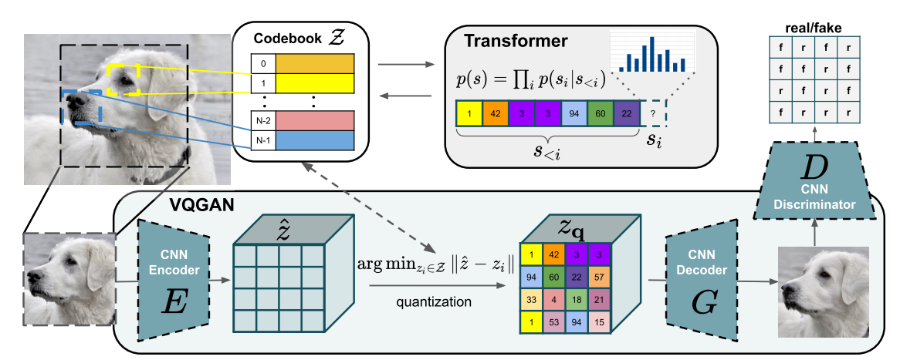
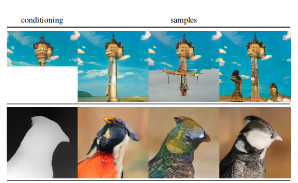
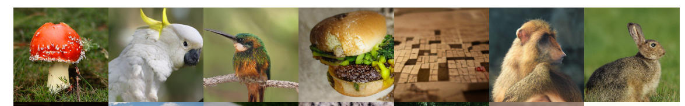

#### Taming Transformers for High-Resolution Image Synthesis

这一篇看的时候，没看代码，很多地方让我抓耳挠腮，气急败坏，看完代码，神清气爽，特地重新写写。

这篇文章是基于**VQ-VAE** 的一个工作，利用**GAN**网络对抗训练encoder,decoder,而不仅仅是一个简单的重建误差，这样可以极大的提升网络生成的质量与语义的丰富程度，同时基于GAN的训练办法，在这几年也有了一些稳定产出，为了增强全局语义和稳定性，有基于**patch**的训练办法，在文章中也使用到了，并且，基于语义的feature map层级的重建误差监督也是一个不小的亮点

### Background

* [[VQ-VAE](https://wangsssssss.github.io/2021/11/26/VQ-VAE/)]
* [[PixelCNN](https://wangsssssss.github.io/2021/11/26/pixelCNN/)]
* [[Transformer](https://wangsssssss.github.io/2021/10/18/CSC/)]
* [[Generative model](https://wangsssssss.github.io/2021/08/20/GenerativeModeling/)]
* [[GAN](https://wangsssssss.github.io/2021/11/03/dcgan/)] 

### Method

输入图片$X$, 通过encoder提取得到，特征图 $Z$，根据语义codebook, 压缩重建特征图 $Z_q$，将重建之后的特征图，通过decoder解码重建为生成图像$\hat X$, 同时discriminator根据输出，进行判别监督，tansformer是另外一回事，采样的时候训练的。因此整个训练过程包含了：

* encoder
* codebook
* decoder
* discriminator



#### Reconstruction

这里的损失函数可以表述为：
$$
L_{vq-vae} = ||X - \hat X||^2 + ||sg[E(X)] - \mathcal Z_q||^2 + ||sg[\mathcal Z_q] - E(X)||2 \\
L_{vq-gen} = \Sigma_{i \in P} ||P_i(X) - P_i(\hat X)||^2 + ||sg[E(X)] - \mathcal Z_q||^2 + ||sg[\mathcal Z_q] - E(X)||^2 \\
L_{vq-dis} = \max [logD(X) + log(1-D(\hat X))] \\
L_{vq-gan} = L_{vq-gen} + \lambda L_{vq-dis}
$$
其中，$\lambda$ 自动调整，根据两个损失函数的梯度大小。

##### codebook

这里的技巧也很强，因为采用了离散化压缩，这个过程不可导，为了传递梯度，采用了将codebook的梯度拷贝到encoder的办法，同时梯度还不应该传递到codebook上，这里用了这样的写法：
$$
z_q = z + (z_q - z).detach()
$$

```python
 def forward(self, z):
        # reshape z -> (batch, height, width, channel) and flatten
        z = z.permute(0, 2, 3, 1).contiguous()
        z_flattened = z.view(-1, self.e_dim)
        # distances from z to embeddings e_j (z - e)^2 = z^2 + e^2 - 2 e * z

        d = torch.sum(z_flattened ** 2, dim=1, keepdim=True) + \
            torch.sum(self.embedding.weight**2, dim=1) - 2 * \
            torch.matmul(z_flattened, self.embedding.weight.t())

        ## could possible replace this here
        # #\start...
        # find closest encodings
        min_encoding_indices = torch.argmin(d, dim=1).unsqueeze(1)

        min_encodings = torch.zeros(
            min_encoding_indices.shape[0], self.n_e).to(z)
        min_encodings.scatter_(1, min_encoding_indices, 1)
        # get quantized latent vectors
        z_q = torch.matmul(min_encodings, self.embedding.weight).view(z.shape)
        # compute loss for embedding
        loss = torch.mean((z_q.detach()-z)**2) + self.beta * \
            torch.mean((z_q - z.detach()) ** 2)
        # preserve gradients
        z_q = z + (z_q - z).detach()
        # perplexity
        e_mean = torch.mean(min_encodings, dim=0)
        perplexity = torch.exp(-torch.sum(e_mean * torch.log(e_mean + 1e-10)))

        # reshape back to match original input shape
        z_q = z_q.permute(0, 3, 1, 2).contiguous()

        return z_q, loss, (perplexity, min_encodings, min_encoding_indices)
```


#### Sample



这里很尴尬，我开始没有搞明白，我觉得这个重建的过程很自然，但是怎么会采样生成各种各样的图片呢，没有看到哪里有添加噪声的地方啊（文章里）。其实，从代码中看，是对于通过对codebook离散化之后的$Z_q$部分保留, 将保留部分对应的标号输入transformer (我觉得不是很合理，尤其是condition的时候，竟然重新训练一个codebook，用来得到condition的坐标！！！)，对剩余的部分用transformer进行自回归，同时采样不是取top1置信的标号，而是根据置信的分布，随机采样，这样就有了丰富的输出。

```python
 def forward(batch,... )
    ''''''
 	quant_z, z_indices = self.encode_to_z(x)
 	quant_c, c_indices = self.encode_to_c(c)

        # create a "half"" sample
	z_start_indices = z_indices[:,:z_indices.shape[1]//2]
	index_sample = self.sample(z_start_indices, c_indices,
               steps=z_indices.shape[1]-z_start_indices.shape[1],
               temperature=temperature if temperature is not None else 1.0,
               sample=True,
               top_k=top_k if top_k is not None else 100,
               callback=callback if callback is not None else lambda k: None)
               x_sample = self.decode_to_img(index_sample, quant_z.shape)
     ''''''
    
  def sample(self, x, c, steps, temperature=1.0, sample=False, top_k=None,
               callback=lambda k: None):
		x = torch.cat((c,x),dim=1)
        block_size = self.transformer.get_block_size()
        assert not self.transformer.training
        ''''''
        some code
        ''''''
        for k in range(steps):
                callback(k)
                x_cond = x if x.size(1) <= block_size else x[:, -block_size:]  
                logits, _ = self.transformer(x_cond)
                # pluck the logits at the final step and scale by temperature
                logits = logits[:, -1, :] / temperature
                # optionally crop probabilities to only the top k options
                if top_k is not None:
                    logits = self.top_k_logits(logits, top_k)
                # apply softmax to convert to probabilities
                probs = F.softmax(logits, dim=-1)
                # sample from the distribution or take the most likely
                if sample:
                    ix = torch.multinomial(probs, num_samples=1)
                else:
                    _, ix = torch.topk(probs, k=1, dim=-1)
                # append to the sequence and continue
                x = torch.cat((x, ix), dim=1)
            # cut off conditioning
          x = x[:, c.shape[1]:]
       return x
	
```

### Result


