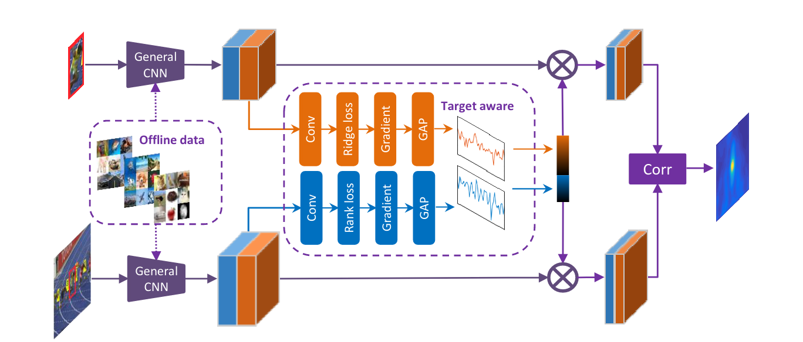
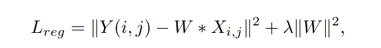
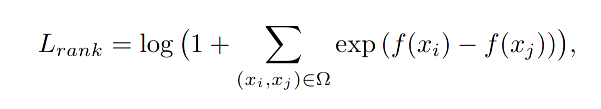

#### Target-Aware Deep Tracking

current improvement in tracking domain mainly focuses on architecture or tacking decision making module, This article exploits the potential capability of feature extractor to produce more distinctive or target aware feature which is around the foreground object. Because the feature backbone is universally trained on predefined classes which will not include the foreground object in target image, or feel excited about background objects seen before.

### Method

follow the siamese network architecture.

#### Initial period

The proposed tracking framework comprises a pre-trained feature extractor, the target-aware
feature module, and a Siamese matching module. The pre-trained feature extractor is offline trained on the classification task and the target-aware part is only trained in the first frame. In initial training, **the regression loss and the ranking loss parts are trained separately and we compute the gradients from each loss once the networks are converged**. With the gradients, the feature generation model selects a fixed number of the filters with the highest importance scores from the pre-trained CNNs. The final target-aware features are obtained by stacking these two types of feature filters. Considering the scalar difference, these two types of features are re-scaled by dividing their maximal channel summation (summation of all the values in one channel)

##### target active

formulate the problem as the ridge regression loss, then after the regression converges, use the gradients of regression loss on feature map to indicate the importance of feature channel.

##### scale active

similar to target active, but formulate the problem as prediction problem.
