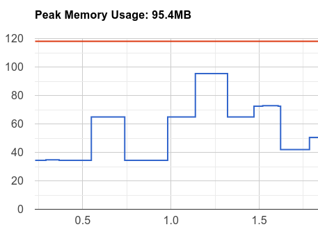
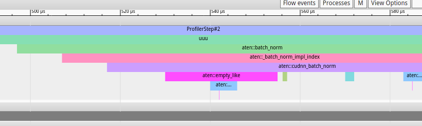

### TensorBoard 文件

用tensorboard写好tfevent了，但是有些时候需要自己手动用plt画图

```python
from tensorboard.backend.event_processing import event_accumulator
#from tensorboard.backend.application import
grain = event_accumulator.EventAccumulator(")
#grain.scalars.size = 1000000
grain.Reload()


normal = event_accumulator.EventAccumulator("")
#normal.scalars.size = 1000000
normal.Reload()


grain_loss = grain.scalars.Items("loss")
normal_loss = normal.scalars.Items("loss")
print(len(normal_loss))


import matplotlib.pyplot as plt
grain_loss = [ g.value for g in grain_loss]
normal_loss = [ n.value for n in normal_loss]

plt.figure()
plt.xlabel("step")
plt.ylabel("loss")
plt.plot(normal_loss[1000:16000:20], label="without multi grain")
plt.plot(grain_loss[1000:16000:20], label="with multi grain")
plt.legend(loc="upper right")
plt.show()
```

tensorboard数据点显示不完全 [[StackOverflow](https://stackoverflow.com/questions/43702546/tensorboard-doesnt-show-all-data-points)]：

```bash
ensorboard --logdir=./logs --bind_all --samples_per_plugin scalars=9999999
```

自己画图读的数据点不完全，修改一下：

```python
# located tensorboard.backend.event_processing / event_accumulator.py
DEFAULT_SIZE_GUIDANCE = {
    COMPRESSED_HISTOGRAMS: 500,
    IMAGES: 4,
    AUDIO: 4,
    SCALARS: 10000,
    HISTOGRAMS: 1,
    TENSORS: 10,
}
```

pytorch 强大的性能测试工具 `profiler` 可以分析网络的`neck` 性能：

```bash
pip install torch_tb_profiler
tensorboard --logdir=./log
```

一个例子：

```python
if __name__  == "__main__":
	model = mobilenet_v2()
    torch.backends.cudnn.benchmark = False
    torch.backends.cudnn.deterministic = True
    model = model.cuda()
    with torch.profiler.profile(
            schedule=torch.profiler.schedule(wait=1, warmup=1, active=3, repeat=2),
   		on_trace_ready=torch.profiler.tensorboard_trace_handler('/home/wang_shuai/mem'),
            #record_shapes=True,
            profile_memory=True,
            with_stack=True
    ) as prof:
        inp = torch.rand([4, 1, 500, 500])
        inp = inp.cuda()
        for step in range(10):
            if step >= (1 + 1 + 3) * 2:
                break

            with torch.no_grad():
                model(inp)
            prof.step()  # Need to call this at the end of each step to notify profiler of steps' boundary.
```

默认只会得到最底层的调用结果，所以对于部分代码，可以使用`record_function` 进行手动标记

#### 重要教训

* 看清tensorboard的坐标轴，有时候坐标轴会变化。。。要不然汇报工作的时候很尴尬

* batchnorm 在pytorch某些实现`cudnn `, `intel mkl dnn` 等一些后端函数上，不是inplace

  ```c++
  std::tuple<Tensor, Tensor, Tensor, Tensor> cudnn_batch_norm(
      const Tensor& input_t, const Tensor& weight_t, const c10::optional<Tensor>& bias_t_opt, const c10::optional<Tensor>& running_mean_t_opt, const c10::optional<Tensor>& running_var_t_opt,
      bool training, double exponential_average_factor, double epsilon)
  {
      ... // some check code
    // output space allocation      
    auto output_t = at::empty_like(*input, input->options(), 
                                   input->suggest_memory_format());
  
    TensorArg output{ output_t, "output", 0 };
  
    auto handle = getCudnnHandle();
    auto dataType = getCudnnDataType(*input);
    TensorDescriptor idesc{ *input, 4 };  // input descriptor
    TensorDescriptor wdesc{ expandScale(*weight, input->dim()), 4 };  // descriptor for weight, bias, running_mean, etc.
      
      ... // some select code
      cudnnBatchNormalizationForwardInference(
        handle, mode, &one, &zero,
        idesc.desc(), input->data_ptr(),
        idesc.desc(), output->data_ptr(),
        wdesc.desc(),
        weight->data_ptr(),
        bias->data_ptr(),
        running_mean->data_ptr(),
        running_var->data_ptr(),
        epsilon);
      
     return std::tuple<Tensor, Tensor, Tensor, Tensor>{output_t, 
                                                       save_mean,
                                                       save_var,
                                                       reserve};
  }
  
  ```

  所以在`conv`后面使用`batch norm`会加倍峰值显存, 最高的那几个都是`batch norm`造成的

  <center>
      
      
  </center>

  


