# Tiny Compiler 分析

- [ ] 姓名：王帅
- [ ] 学号：2018302412

********************************

## Tiny Compiler 介绍

Tiny 编译器是一个仅有两千行代码的小型编译器，但是麻雀虽小，五脏俱全，这个编译器不仅实现了编译器的前端和代码生成，甚至还带有一个可运行的虚拟机，可供操作。

## 词法分析

词法分析通过getToken函数实现，基本基于有限自动状态机,通过getNextChar函数读入新的字符，通过状态机判断输入类型，进而分析得到token。

### 字符输入获取

字符输入通过一次读入一行，然后放入缓冲区，这样可以避免多次连续的取的开销，每次get是在这一行中取出相应的字符，如果这一行遍历完成，于是读取下一行。

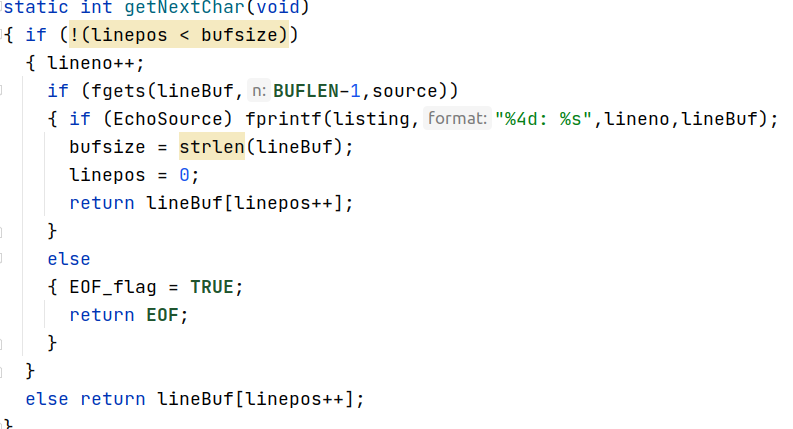

### 有限自动状态机DNF

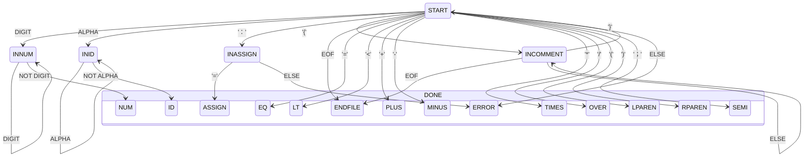

## 语法分析

语法分析采用递归下降分析法构建语法分析树，

### 语法分析树数据结构

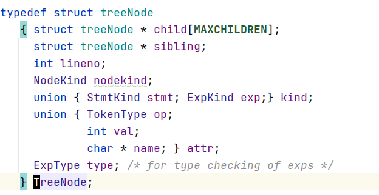

### 语法分析

整个程序文本，就是stmts，可以划分为多个代码块，对于每个代码块进行递归下降分析。

包括，IF， REPEAT，ASSIGN，IO等语句

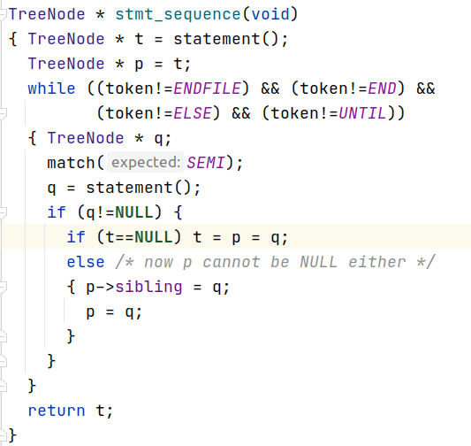


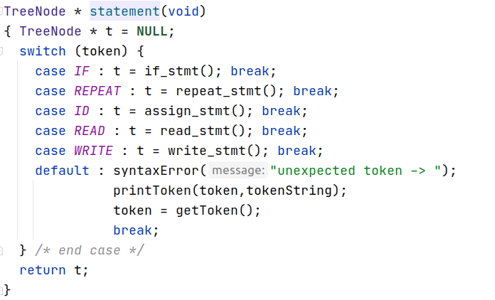

#### if 分支语句

在If分支语句中，首先匹配IF，然后匹配expression，然后匹配THEN，接下来如果存在ELSE语句的话，就继续匹配else语句，最后匹配一个end结束符。

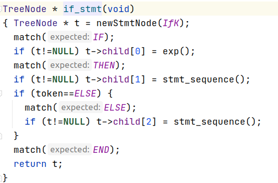

##### expression表达式

exp表达式可以由simple表达式，或者通过小于或者等于连接的simple表达式，

而simple表达式是用term构成，term是由factor或者通过乘除符号连接起来的factor构成，factor是基于常数或者标识符。

**trick**：这里分级（exp， sexp，term factor）**可以利于符号优先级**

```c++
TreeNode * exp(void)
{ TreeNode * t = simple_exp();
  if ((token==LT)||(token==EQ)) {
    TreeNode * p = newExpNode(OpK);
    if (p!=NULL) {
      p->child[0] = t;
      p->attr.op = token;
      t = p;
    }
    match(token);
    if (t!=NULL)
      t->child[1] = simple_exp();
  }
  return t;
}
```

#### repeat循环语句

```c
TreeNode * repeat_stmt(void)
{ TreeNode * t = newStmtNode(RepeatK);
  match(REPEAT);
  if (t!=NULL) t->child[0] = stmt_sequence();
  match(UNTIL);
  if (t!=NULL) t->child[1] = exp();
  return t;
}
```

#### assign赋值语句

assign语句，将stmt的左边属性存储在自己节点中，右边表达式存储在第一个孩子中

```c
TreeNode * assign_stmt(void)
{ TreeNode * t = newStmtNode(AssignK);
  if ((t!=NULL) && (token==ID))
    t->attr.name = copyString(tokenString);
  match(ID);
  match(ASSIGN);
  if (t!=NULL) t->child[0] = exp();
  return t;
}
```

#### 文件io语句

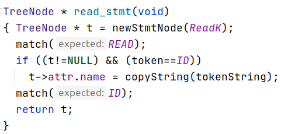


​                                                 

### 测试语法树

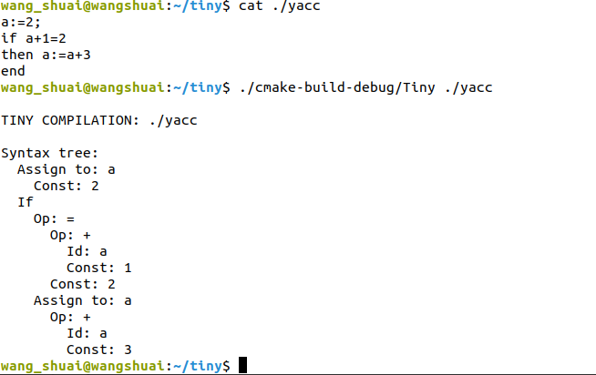


## 构建符号表

建立好语法分析树之后，就需要通过构建符号表，把分析树上的节点进一步关联起来，因为现在对于每一个标识符，都是当成独立的标识符，但是同名的变量，应该是同一个变量才对

### 数据结构

```c
typedef struct LineListRec
   { int lineno;
     struct LineListRec * next;
   } * LineList;

typedef struct BucketListRec
   { char * name;
     LineList lines;
     int memloc ; /* memory location for variable */
     struct BucketListRec * next;
   } * BucketList;

static BucketList hashTable[SIZE];
```

这里每个Bucket代表一个变量的信息，包含出现的行数，分配的地址，以及变量名称，

### 符号表构建

**哈希函数插入符号**     通过哈西函数加快查询速度，当发生碰撞的时候，就新建一个bucket插入到bucketlist的首部位置。

```c
void st_insert( char * name, int lineno, int loc )
{ int h = hash(name);
  BucketList l =  hashTable[h];
  while ((l != NULL) && (strcmp(name,l->name) != 0))
    l = l->next;
  if (l == NULL) /* variable not yet in table */
  { l = (BucketList) malloc(sizeof(struct BucketListRec));
    l->name = name;
    l->lines = (LineList) malloc(sizeof(struct LineListRec));
    l->lines->lineno = lineno;
    l->memloc = loc;
    l->lines->next = NULL;
    l->next = hashTable[h];
    hashTable[h] = l; }
  else /* found in table, so just add line number */
  { LineList t = l->lines;
    while (t->next != NULL) t = t->next;
    t->next = (LineList) malloc(sizeof(struct LineListRec));
    t->next->lineno = lineno;
    t->next->next = NULL;
  }
} 
```

**分析语法树节点**  根据语法树上的节点类型，来判断是否存在变量，如果变量已经插入了符号表，那么只需要插入本次出现的行号就行，如果没有出现过，那么就需要考虑内存的分配

赋值语句和文件读取的节点，都是在节点上存储左值的变量名

```c
static void insertNode( TreeNode * t)
{ switch (t->nodekind)
  { case StmtK:
      switch (t->kind.stmt)
      { case AssignK:
        case ReadK:
          if (st_lookup(t->attr.name) == -1)
          /* not yet in table, so treat as new definition */
            st_insert(t->attr.name,t->lineno,location++);
          else
          /* already in table, so ignore location, 
             add line number of use only */ 
            st_insert(t->attr.name,t->lineno,0);
          break;
        default:
          break;
      }
      break;
```

表达式类型的节点中，只有ID类型的节点会是变量，其他的只有可能是常量或者操作符以及左右括号

```c
case ExpK:
      switch (t->kind.exp)
      { case IdK:
          if (st_lookup(t->attr.name) == -1)
          /* not yet in table, so treat as new definition */
            st_insert(t->attr.name,t->lineno,location++);
          else
          /* already in table, so ignore location, 
             add line number of use only */ 
            st_insert(t->attr.name,t->lineno,0);
          break;
        default:
          break;
      }
      break;
    default:
      break;
  }
}
```

#### 遍历语法树

进行先序遍历符号表，构建符号表的目的是为了推理类型检查，以及后续内存分配，因此不牵扯顺序问题，也可以采用其他遍历方式

```c
static void traverse( TreeNode * t,
               void (* preProc) (TreeNode *),
               void (* postProc) (TreeNode *) )
{ if (t != NULL)
  { preProc(t);
    { int i;
      for (i=0; i < MAXCHILDREN; i++)
        traverse(t->child[i],preProc,postProc);
    }
    postProc(t);
    traverse(t->sibling,preProc,postProc);
  }
}
```

## 符号检查

遍历语法树，根据操作符或者语句类型判断对应节点是否合法

## 代码生成

代码生成也是采用递归方式，对当前节点以及他的孩子进行递归生成代码，本段代码块生成完成之后，就进行下一段代码块的生成，也就是当前节点的兄弟节点

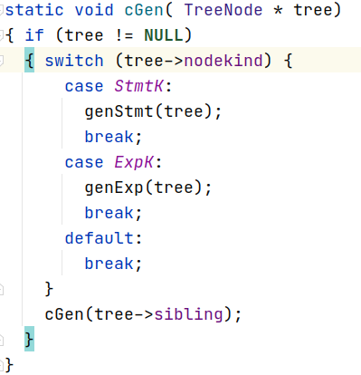

### expr生成

* 常值

  ```c
  emitRM("LDC",ac,tree->attr.val,0,"load const");
  ```

* 标识符

   ```c
  loc = st_lookup(tree->attr.name);
  emitRM("LD",ac,loc,gp,"load id value");
  ```

* 运算符

  运算符结构，通过堆栈来寄存左右的表达式值，然后根据节点的运算符来，对左右的结果计算

  ```c
  p1 = tree->child[0];
  p2 = tree->child[1];
  cGen(p1);       
  emitRM("ST",ac,tmpOffset--,mp,"op: push left");      
  cGen(p2);        
  emitRM("LD",ac1,++tmpOffset,mp,"op: load left");
  ```

  计算类型主要为：

  ```c
  //直接计算得到结果
  emitRO("ADD",ac,ac1,ac,"op +");
  
  //bool表达式判断
  emitRO("SUB",ac,ac1,ac,"op <") ;
  emitRM("JLT",ac,2,pc,"br if true") ;
  emitRM("LDC",ac,0,ac,"false case") ;
  emitRM("LDA",pc,1,pc,"unconditional jmp") ;
  emitRM("LDC",ac,1,ac,"true case") ;
  ```

### stmt 生成

stmt生成过程要特别注意，将全局生成的绝对位置，在跳转指令生成式转换为**运行时pc的相对地址**

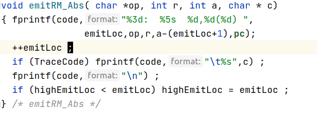

* IF 语句

  - [ ] 生成条件代码，然后空出一行，保存位置loc1（用来跳转到else）
  - [ ] 生成then处的代码，然后也空出一行，保存位置loc2（用来跳转end）
  - [ ] 返回loc1,这个时候就知道else处语句在哪了，loc1填充跳转到else
  - [ ] 生成else处的代码
  - [ ] 返回loc2,这个时候，这个if块的结尾也明朗起来，写上无条件跳转到end
  - [ ] 这个时候全局的生成行数就需要恢复到end处（根据high）

  ```c
  		p1 = tree->child[0] ;
  		p2 = tree->child[1] ;
  		p3 = tree->child[2] ;
  		/* generate code for test expression */
           cGen(p1);
           savedLoc1 = emitSkip(1) ;
           emitComment("if: jump to else belongs here");
           /* recurse on then part */
           cGen(p2);
           savedLoc2 = emitSkip(1) ;
           emitComment("if: jump to end belongs here");
           currentLoc = emitSkip(0) ;
           emitBackup(savedLoc1) ;
           emitRM_Abs("JEQ",ac,currentLoc,"if: jmp to else");
           emitRestore() ;
           /* recurse on else part */
           cGen(p3);
           currentLoc = emitSkip(0) ;
           emitBackup(savedLoc2) ;
           emitRM_Abs("LDA",pc,currentLoc,"jmp to end") ;
           emitRestore() ;
  ```

  

* 循环语句

  基本原理以及注意项和if语句一致

  ```c
  p1 = tree->child[0] ;
  p2 = tree->child[1] ;
  savedLoc1 = emitSkip(0);
  /* generate code for body */
  cGen(p1);
  /* generate code for test */
  cGen(p2);
  emitRM_Abs("JEQ",ac,savedLoc1,"repeat: jmp back to body");
  ```

* 赋值语句

  计算右边表达式的值，然后将值从寄存器中，存到内存中

  ```c
  cGen(tree->child[0]); /* now store value */
  loc = st_lookup(tree->attr.name);
  emitRM("ST",ac,loc,gp,"assign: store value");
  ```

* IO语句

  ```c
  emitRO("IN",ac,0,0,"read integer value");
  loc = st_lookup(tree->attr.name);
  emitRM("ST",ac,loc,gp,"read: store value");
  ```

  

## 虚拟机

虚拟机代码实现比较简单，将指令集分为RR，RM，RA，分别代表了寄存器运算，加载内存里的内容，加载地址，这三个部分，通过读入文件的所有虚拟机指令序列，然后模拟执行。

### 指令集

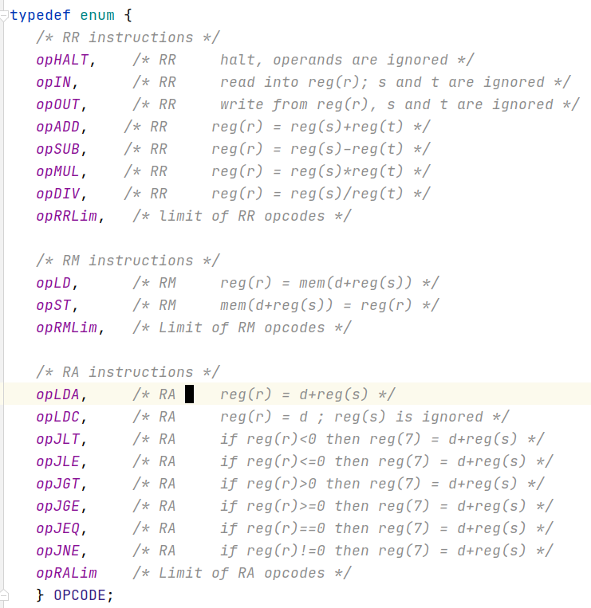

### 数据结构

#### 指令

通过将简单指令分解为op，和args，来模拟执行指令序列

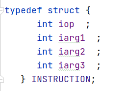

#### 寄存器与内存

通过模拟数据内存与指令内存，以及寄存器

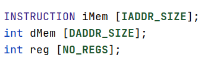

### 虚拟机执行过程

#### 初始化

初始化包括对数据内存的清零以及对指令内存的写入停止指令，完成之后读入虚拟机指令序列，从低地址向高地址逐步写入。

#### 解析执行

- [x] 取指

  ```c
    pc = reg[PC_REG] ;
    reg[PC_REG] = pc + 1 ;
    currentinstruction = iMem[ pc ] ;
  ```

- [x] 解析参数

  ```c
    switch (opClass(currentinstruction.iop) )
    { case opclRR :
      /***********************************/
        r = currentinstruction.iarg1 ;
        s = currentinstruction.iarg2 ;
        t = currentinstruction.iarg3 ;
        break;
     ....
    }    
  ```

- [x] 执行

  ```c
  case opADD :  reg[r] = reg[s] + reg[t] ;  break;
  case opSUB :  reg[r] = reg[s] - reg[t] ;  break;
  case opMUL :  reg[r] = reg[s] * reg[t] ;  break;
  ```

  

### 测试

* 编写代码

  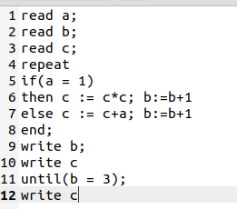

* 编译

  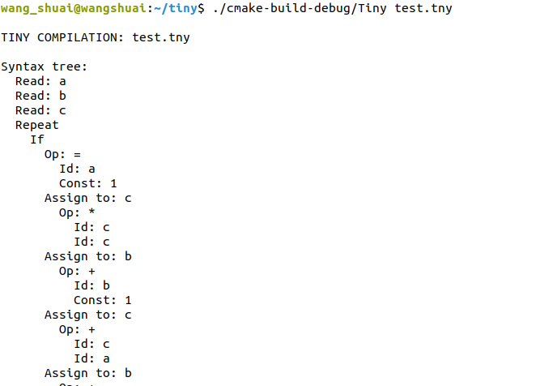

* 运行

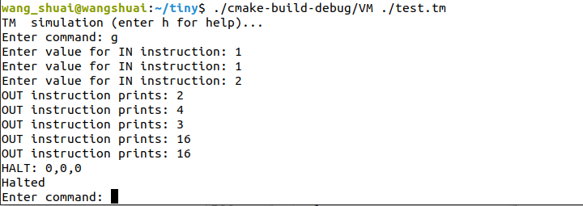