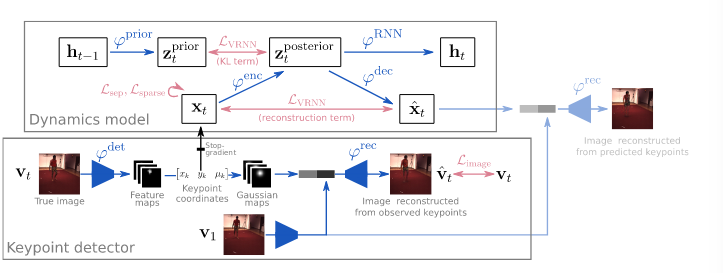
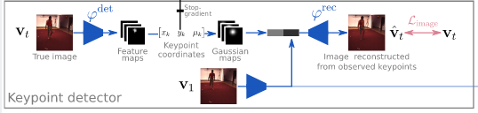
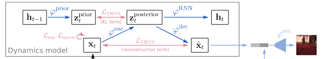
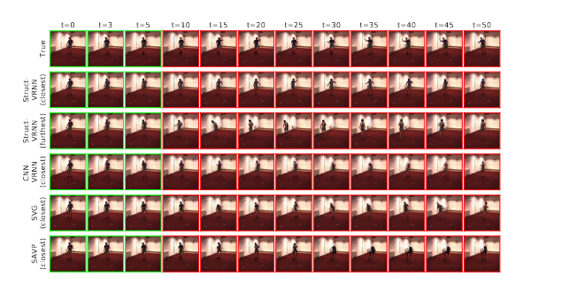

#### Unsupervised Learning of Object Structure and Dynamics from Videos

[[PDF](https://arxiv.org/pdf/1906.07889v3.pdf)] [[PaperWithCode](https://paperswithcode.com/paper/unsupervised-learning-of-object-structure-and)] 

This article aims to address extracting and predicting objects structures and dynamics without supervision. And successfully use Key-Point based image representation  outperforms unstructured representations on a lot of motion-related tasks

#### Challenges of Future Frame Predict based Video Understanding

* pixel-level predictions is sensitive and fragile because of the dynamic property of video
* the pixel-level trained representations is rarely valid for downstream tasks

#### Key-Point based representation

##### Unsupervised key-point detector

similar to variant-auto-encoder [VAE] architecture. use $\phi^{det}$ to formula K-dimension feature maps, each dimension is represent a key point, which is different to dense key-point representation. Instead, in the dense representation heatmap, a vector located in $(x,y)$, is called as a key point feature vector.  **while this article propose a sparse representation, where each dimension is implying a key point ** and then normalize and condense each feature map $f_{1:K}$ into triple $(x_k,y_k,\mu = \bar f_k)$, the triple can be used to reconstructed into a Gaussian-shaped blob representation

* normalize and condense by compute the expectation

  $$ x_k = \bar x $$

  $$ y_k = \bar y $$

  $$\mu_k = \bar f_k$$

the training procedure encounter a serious problem, what if two key-points is correlated heavily, which is imply those two is represent a some object or property of video, thus need some penalty 

* **temporal separation loss** 

  $$L_{sep} = \Sigma \Sigma \exp ({-d_{kk^*}\over 2\sigma^2 })$$

  $$d_{kk*} = {1\over T} \Sigma L_2(\hat x_{t,k} , \hat x_{t, k*})$$

* **key point sparsity loss**

  $$L_{spa} = \Sigma |\mu_k|$$

##### Stochastic dynamics model

$h_t$ is the hidden state of RNN update neural network

$z_t$ is the other state, and in this article call it latent variable, while RNN is upgrading to VRNN

the update step is formula as following :

$$p(z_t|x_{<t}, z_{<t}) = \phi ^{prior}(h_{t-1})$$

$$p(z_t|x_{\leq t}, z_{<t}) = \phi ^{enc}(h_{t-1}, x_t)$$

$$p(x_t|x_{<t}, z_{\leq t}) = \phi ^{dec}(h_{t-1}, z_t)$$

$$h_t = \phi_{RNN}(x_t, z_t, h_{t-1})$$

##### Training of dynamics

like the VAE, VRNN also use the evidence lower bound loss , which is composed of the reconstructed loss and a KL-divergence which aims to minimize the difference between prior $p(z_t|x_{<t}, z_{<t})$ and the posterior  $p(z_t|x_{\leq t}, z_{<t})$.

$$L_{VRNN} = - E[log(p(x_t|x_{<t}, z_{\leq t}) - \beta KL(p(z_t|x_{<t}, z_{<t})|| p(z_t|x_{\leq t}, z_{<t}))] $$

$$L_{VRNN} = - E[log(p(x_t|x_{<t}, z_{\leq t}) - \beta KL(post, prior)] $$

$$L_{VRNN} = - E[log(p(x_t|x_{<t}, z_{\leq t}) - \beta KL(\phi^{enc}, \phi^{prior})] $$

in order to establish a long term predict ability, which use the whole video to predict finial frame :

$$L_{future} = - E[log(p(x_t|x_{\leq T}, z_{\leq t})] $$

#### Experiment

##### Video prediction

