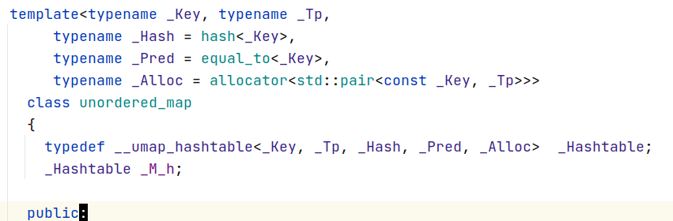
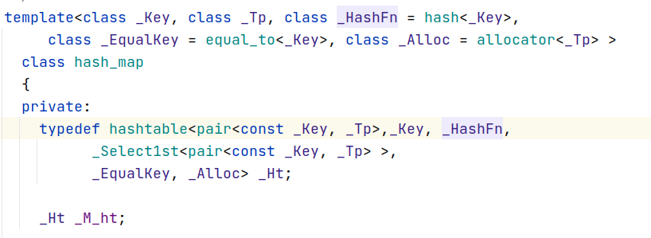
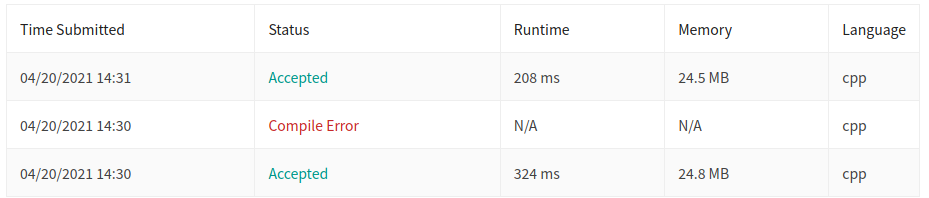
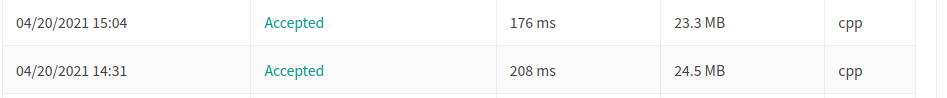

## unordered map

以前听说过unordered map，但是自己没有试过，不知道map和unorder map底层有啥不同，刷题的时候看见了，决定抽几分钟做个笔记

unordered map是基于哈西表, 看代码的时候还发现了一个hash map，看上去是被废弃了，unorder map可以干hash map的事情，而且俩都是基于哈西的

然后：

`unordered_map` containers are faster than `map` containers to access individual elements by their *key*, although they are generally less efficient for range iteration through a subset of their elements.

对于某个题目，我测试了一下，的确快了，占用还小了，这太不应该了，我就不理解了？？？？

唯一确定的是，要用hash算法，static肯定比local好一点

