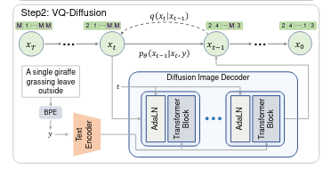
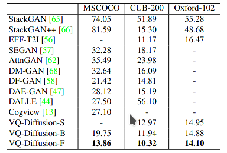

#### Vector Quantized Diffusion Model for Text-to-Image Synthesis

The latent space based text to image approach is very suitable for fuse word vector and image information. Dall-e, taming transformer(vq-gan), vq-vae, which all are categorized as the above mentioned method, generate very impressive results. but these methods employed regressive dependency as the connection between token and tokens, which harms the parallel capacity and will accumulate error in autoregressive manner. this article addresses the autoregressive dependency by introducing diffusion model.  

### Method

* codebook [[VQ-VAE]()]
* text to image 

#### VQ-Diffusion

* mask token        (pure noise)
* transfer token   (markov chain)
* noiseless token (to directly predict original token)

codebook consists of $N$ image tokens, thus every image $\mathbb I$ processed after encoder $\mathcal X$, then can be discretized as  $\mathbb X$ :
$$
\mathbb X = \text{codebook} \textbf{[} \ \ \text {encoder}(\mathbb I) \  \ \textbf{]}
$$
for convenient to read and to describe the diffusion process, every element in $\mathbb X $, i use $x$ to represent. the $v(x), \text{len}(v) \to N+1$ is a one-hot vector representation to indicate which discrete state (codebook item + mask item) it is.
$$
\begin{aligned}
q(x_t | x_{t-1}) &= v^T(x_t) \mathbb Q_t v(x_{t-1}) \\
\mathcal Q_t &= \Pi_{i=0}^t \mathbb Q_i \\
q(x_t | x_0) &= v^T(x_t)  \mathcal Q_t v(x_0) 
\end{aligned}
$$
$\mathbb Q$ is the transmission matrix, tells how to transfer from one state to another. $\alpha$ represent the probability to stay at current state, while $\beta$ indicates the probability to transfer to some state with probability $1\over {k+1}$ uniformly, and $\gamma$ on behalf of mask token.
$$
\mathbb Q = 
\begin{bmatrix}
&\alpha & \beta & \beta & \beta  & ... & 0 & \\
& \beta &  \alpha & \beta  & \beta & ... & 0 & \\
&\beta &  \beta & \alpha  & \beta & ... & 0 \\
&\vdots & \vdots &\vdots &\vdots &\ddots &\vdots  & \\
&\gamma &\gamma &\gamma &\gamma &\gamma & 1
\end{bmatrix}
$$

after compute the forward noise transform process, the posterior is need for loss compute.
$$
\begin{aligned}
q(x_{t-1} | x_t , x_0) &= q(x_t | x_{t-1} , x_0) { q(x_{t-1} | x_0) \over q_(x_t | x_0) } \\
q(x_{t-1} | x_t , x_0) &= v^T(x_t)\mathbb Q_t v(x_{t-1}) {v^T(x_{t-1})\mathcal Q_{t-1} v(x_{0}) \over v^T(x_t)\mathcal Q_t v(x_{0})}
\end{aligned}
$$
finally, to consider the loss item, and remember $p_{\theta}(X_T)$ is $[\beta, \beta , \beta, \ldots, \gamma]$ , which is a constant vector :
$$
\begin{aligned}
\mathbb L_{vlb} &= \mathop \Sigma_{i=0}^T\mathbb L_{i} \\
\mathbb L_{T} &= \mathbb D_{kl}(q(\mathbb X_T | \mathbb X_0) \ \ || \ \ p_{\theta}(\mathbb X_T)) = \text{const} \\
\mathbb L_{i}  &=  \mathbb D_{kl}(q(\mathbb X_t | \mathbb X_{t+1}, \mathbb X_0) \ \ || \ \ p_{\theta}(\mathbb X_t | \mathbb X_{t+1}, y)) \\
\mathbb L_{0} &= -\log { p_{\theta}(\mathbb X_0 | \mathbb X_1, y)}
\end{aligned}
$$
 but, this article mentioned a vital staff, **noiseless token prediction**,  this method  significantly improves generation quality due to the property of noiseless token.
$$
p_{\theta}(x_{t-1} | x_t, y) = \Sigma_{\hat x_0=1}^K q(x_{t-1} | x_t , \hat x_0) p_{\theta}(\hat x_0 | x_t, y) \\
\mathbb L_{x_0} = -\log p_{\theta}(x_0|x_t, y)
$$
this article speed up the inference speed by increasing  the time stride $\triangle_t$ and using **noiseless token prediction**:
$$
p_{\theta}(x_{t-\Delta_t} | x_t, y) = \Sigma_{\hat x_0=1}^K q(x_{t-\Delta_t} | x_t , \hat x_0) p_{\theta}(\hat x_0 | x_t, y) \\
\mathbb L_{x_0} = -\log p_{\theta}(x_0|x_t, y)
$$

### Experiment

