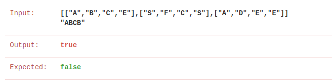
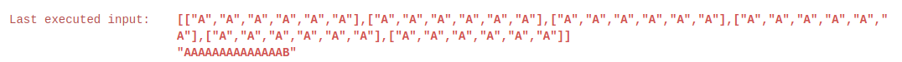

一道我一直打补丁的模板题，感觉最顺手的就是搜索了

Given an `m x n` grid of characters `board` and a string `word`, return `true` *if* `word` *exists in the grid*.

The word can be constructed from letters of sequentially adjacent  cells, where adjacent cells are horizontally or vertically neighboring.  The same letter cell may not be used more than once.

 

**Example 1:**


```
Input: board = [["A","B","C","E"],["S","F","C","S"],["A","D","E","E"]], word = "ABCCED"
Output: true
```

题解：

```c++
class Solution {
public:

    struct node
    {
        int x, y;
        string str;
        int n;

        vector<pair<int, int>> path;
    };

    int dx[4] = {1,0,0,-1};
    int dy[4] = {0,-1,1,0};
    bool exist(vector<vector<char>> board, string word)
    {
        queue<node>q;
        set<char> al;
        for(int i=0; i<board.size(); i++)
        {
            for(int j=0; j<board[0].size(); j++)
            {
                al.insert(board[i][j]);
             if(board[i][j] == word[0])
             {
                 vector<pair<int, int>> path;
                 path.push_back(pair<int, int>(i,j));

                 q.push({i,j,""+ string(1,board[i][j]),1, path});
             }
            }
        }
        for(int i=0; i<word.length(); i++)
        {
            if(al.count(word[i]) == 0)
            {
                return false;
            }
        }

        while (!q.empty())
        {
            node current = q.front();
            q.pop();
            if(current.str == word)
            {
                return true;
            }
            for(int i=0; i<4; i++)
            {
                int x = current.x + dx[i];
                int y = current.y + dy[i];
                if(x >= 0 && x<board.size() && y >= 0 && y < board[0].size())
                {
                    string str = current.str + board[x][y];

                    pair<int ,int> point(x,y);
                    auto path = current.path;
                    vector<pair<int, int>>::iterator it;

                    bool flag = false;
                    for(it = path.begin(); it!= path.end(); it++)
                    {
                        if(point == *it)
                        {
                            flag  = true;
                            break;
                        }
                    }

                    if(flag)continue;

                    path.push_back(point);
                    if(str == word.substr(0,current.n+1))
                    {
                        q.push({x,y,str,current.n+1, path});
                    }
                }
            }
        }

        return false;
    }
};
```


1. 问题：这个题目搜索不能回到已经搜过的地方，如果是一个dfs，就没啥问题了，可惜我一开就是bfs，天呐，直接裂开。

   后面就把整个路径存起来，解决了

   

2. 超时间

   

   无奈了，加了个set判断是否出现所有字母，竟然过了


