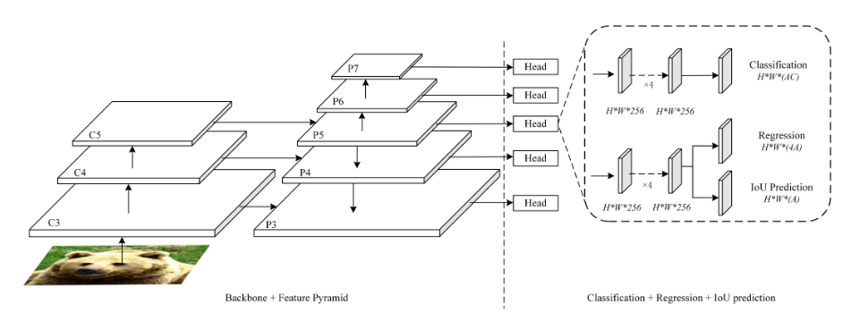

## YOLOX reading

闲来无事，决定读一下这篇文章，实验的细节说的很详细，也给我开阔了很多的思路，但是整体思路很简单就是用已经存在的结构技巧（branch head）+OTA（最优传输）的技术做了很多实验

### 我的问题

* Decoupled head 实验表明，可以加块收敛，但是会损害精度提升，为什么会这样？

  Concretely, it contains a 1 ×1 conv layer to reduce the channel dimension, followed by
  two parallel branches with two 3 ×3 conv layers respectively. We report the inference time with batch=1 on V100 in Tab. 2 and the lite decoupled head brings additional 1.1
  ms (11.6 ms v.s. 10.5 ms)

  **真是服了水这篇的人了，tm参数量都不一样，推理明显慢了1ms, 这解耦头也太随意了吧**

  

* 什么是  IOU branch

  **IOU-aware branch** 提出为了解决anchor base结构在后处理中的问题， nms在下面预测中存在的问题，nms中A2 B2 C2 会好于 A1 B1 C1，这显然不对，同时也会导致ap的降低，所以要让网络学会预测先验IOU

  

  网络结构基本如下：

  

  * 推理过程：

    

  * 训练过程：

  

  

* 那为什么要在anchor free的end2end结构中引入这个呢？

  

### 一般的知识

#### Muti positive

引入了 **center sampling**， 这样可以解决网络预测正样本稀疏问题，（提供了**正样本的梯度**）

#### SimOTA

简化版的最优传输，就是说预测只取与标签（多标签）的损失最小的前K个，不是说对所有的都进行，可以减少计算量

上面这两个应该**不是共存的**，本质上都是正样本分配

### 神奇的知识

* **FPN level上的sample assign**，这个问题有什么意义呢，就是我保证了一个特征向量代表的范围就固定的，也就是网络的搜索范围变小了，以前写SSD，有过这个疑惑，有一个问题，我一直看到，但是没想着去解决，
* **MIXUP Mosaic** 很顶用

### 结论

建议去除孙剑老师，我就不信这缝合怪能中
