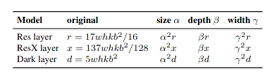
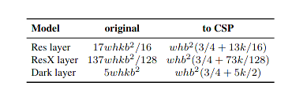
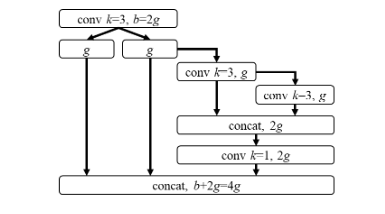
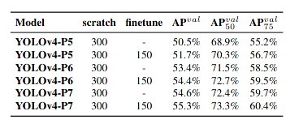
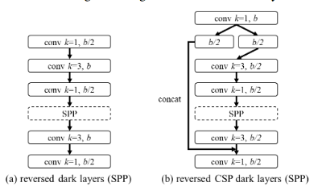
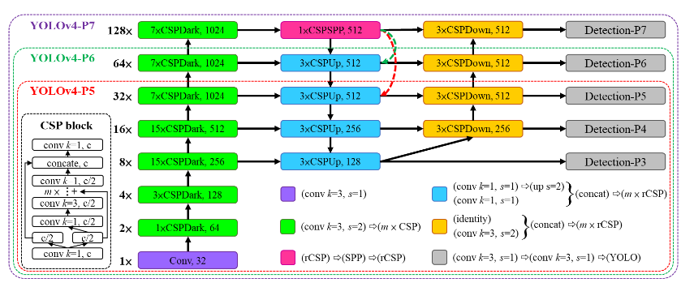
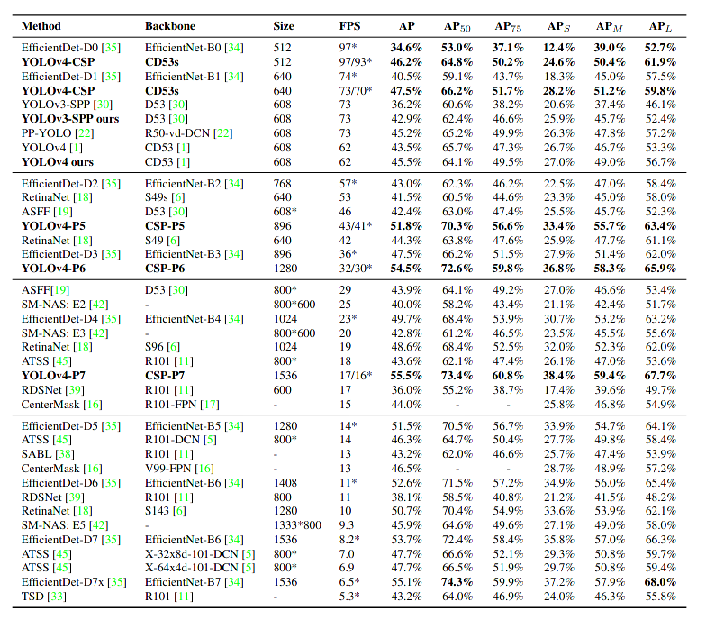

### Scaled-YOLOv4: Scaling Cross Stage Partial Network

## Motivation

Assumed object detection plays an vital role in general life facilitated by artificial intelligence. Application area varies from self-driving vehicles to medial image analysis, even in business analytics, leading to various compute  devices, from general cloud GPU to IOT embedded devices. Thus a scaling technique targeted to object detection required widely.

## Backgroud

As for the proposed demands, automated model design strategy  for object detection mainly including **NAS ** and **Model Scaling**.   **NAS** is short for network architecture search, which take a set of hyperparameters in control of the basic property of  backbone, neck and head, thus search this structure space via reinforcement learning or gradient based approaches, **Model Scale** is regard the depth ,width(channels)  of neural network and the input size as the study topics. Given a computation device constraints and task mission, such as inference speed or test accuracy , to adjust these variables in order to find a suitable architecture. 

### Model scaling

Given a resnet, consists of **k** res layers, which is  **[conv1x1-b/4, conv3x3-b/4,  con1x1-b]**, and image size is set to **[w,h]**, thus the computation amount is approximate as $17whkb^2\over 16$ 

$$r = k[{whb^2\over 4} + {whb^2\over 16} + {whb^2\over 4}] = {17whkb^2\over 16}$$

    
    

   

**low-end devices**, the inference speed of a designedmodel is not only affected by the amount of computation and model size, but more importantly, the limitation of peripheral hardware resources must be considered. Therefore, when performing tiny model scaling, we must also consider factors such as memory bandwidth, memory access cost (MACs), and DRAM traffic.

Thus **YOLOV4-tiny** is proposed to achieve a linear computation complexity for low end devices , which use following design :

**YOLOv4** is designed for real-time object detection on general GPU, which change origin dark layers to CSP layer to reduce computation complexity

    
    

**YOLOv4-large** is designed for cloud GPU, the main purpose is to achieve high accuracy for object detection. We designed a fully CSP-ized model **YOLOv4-P5** and scaling it up to **YOLOv4-P6** and **YOLOv4-P7**

### Exprimental

