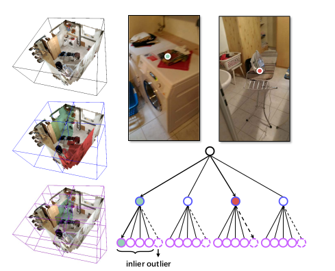
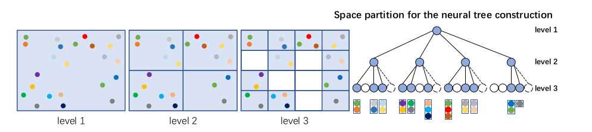
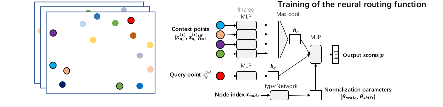
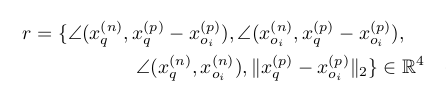
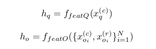
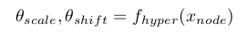
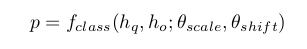
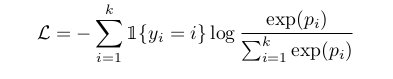
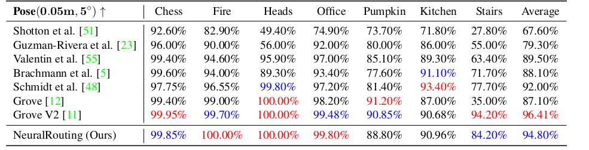
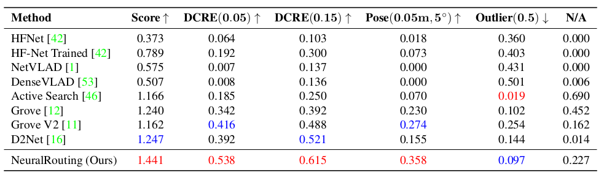

#### Robust Neural Routing Through Space Partitions for Camera Relocalizationin Dynamic Indoor Environments

## 论文介绍

本文提出了一个在动态场景可以精确计算相机位姿的算法，包含了三部分，根据已知场景构建决策树，

路由算法，相机位姿计算

## 算法

### Hierarchical Space Partition for Decision Tree

聚类方法：对于3D scene environment， 利用最小包围立方体和最优切割算法（对最长的边进行切割），来构建给定层次的决策树，形成叶子结点和分类节点，叶子结点具有几何意义，表示一个三维范围，其中有多个三维点

### Outlier-aware Neural Routing Function

1. 构造点对

   对于query点，每个split节点和query构成一个12维的${x_q^p,x_q^n,x_o^p,x_o^n}$

   其中$x_o^n$是该点紧邻的17的点的法向

2. 旋转不变

   

3. 路由函数

   

   超参数通过supernet学习，同时路由函数在同一层上，split 节点共享：

   

4. 外点去除

   相当于分类任务里的background的想法

5. loss crossentropy loss

   

### Camera Pose Estimation

​     路由之后，只得到了单个像素在三维空间里的范围，同时知道最后落入的叶子结点中有多个3d point，因此想到了用这些点去加权，本文采用mean shift算法去计算像素在叶子结点的三维空间的中心，然后通过高斯混合模型来加权得到估计坐标。

​     利用这些坐标计算icp，每个icp需要三对点，通过RANSAC算法，采样生成1024个icp结果，去除掉不符合的结果，然后排序，取最好的一次。

由于路由算法计算的分类置信度，因此还可以做置信度加权来soft estimate 3d point。 

### 实验结果

