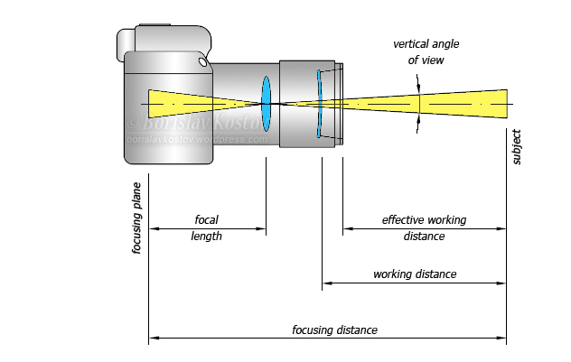

## 记录一些常用的术语

***Focal length*** is the distance from the  focusing plane (where the camera’s sensor is) to the rear nodal point of the lens, when focused at infinity. This is a property of the lens,  which determines the angle of view as well as the perspective.

***Focusing distance*** is the distance from the focusing plane to the subject.

${ds\over df} = {(f1 - f1)\over (f2 - f3)}$

$given : \Sigma \Sigma w(x+dx, y+ dy) =1 $​

$color(x, y) =  \Sigma \Sigma w(x+dx, y+ dy) * color(x+dx, y + dy)$

