## 关系及其运算

### 笛卡尔积

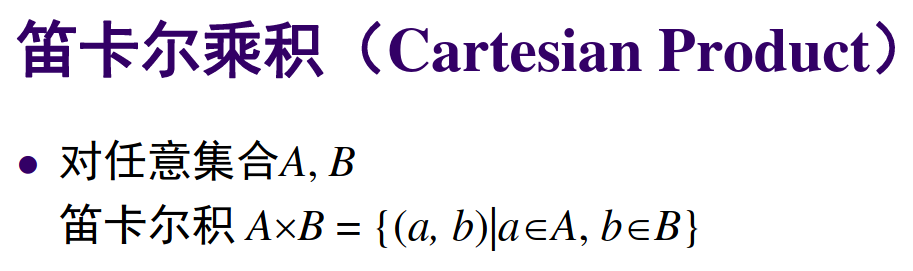

### 二元关系

二元关系就是有序对

### 关系的运算

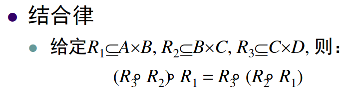

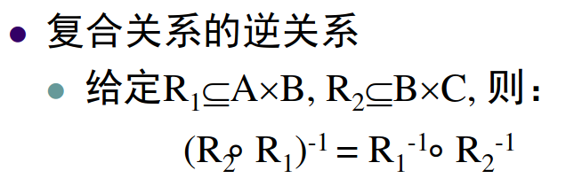

### 01矩阵

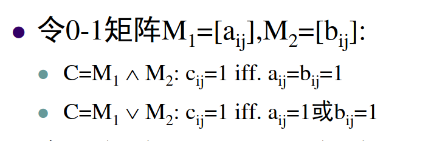

### 关系的性质

* reflexive 
* irreflexive
* symmetric
* antisymmetric
* transitive

## 二元关系性质

传递闭包的对称闭包不一定是传递闭包

### 自反闭包

### 对称闭包

### 传递闭包

### 等价关系与等价类

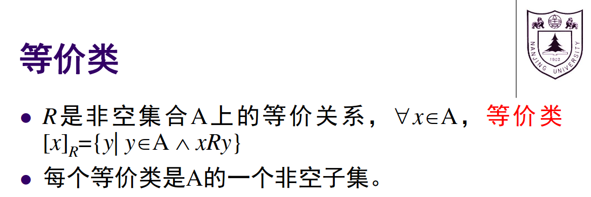

### 商集

等价类诱导的划分

## 偏序与偏序格

### 偏序 poset

### 哈斯图

指令之间的调用关系，有向无环图

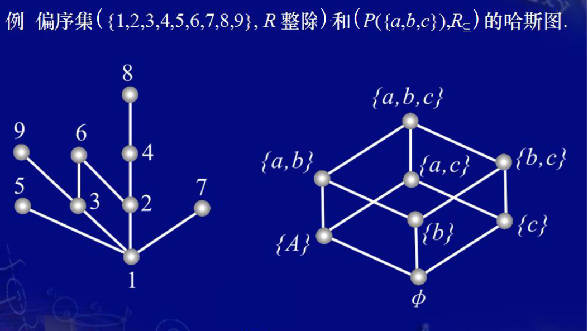

* 极大元
* 极小元
* 最大元
* 最小元
* 最小上界（要可比较，才存在）
* 最大下界（要可比较，才存在）

### 格

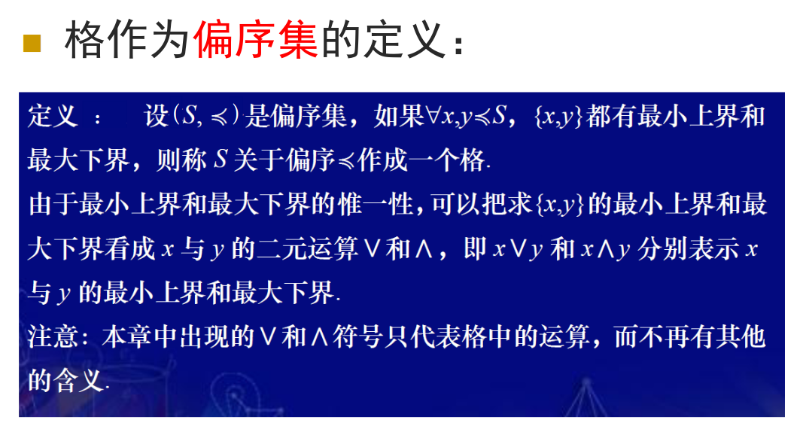

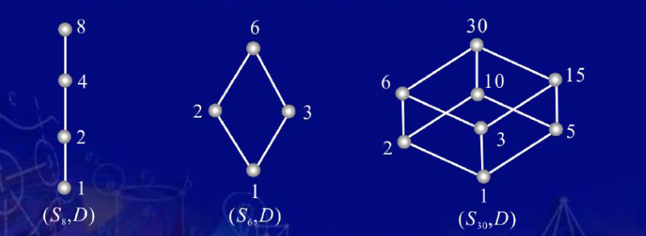

## 代数系统

* 封闭性

### 同构和同构映射

同构是双射函数，同态正常映射

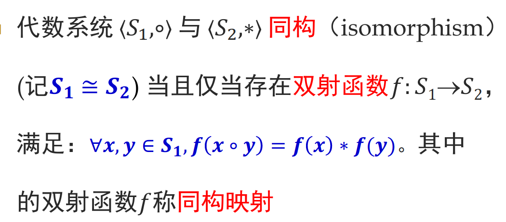

### 同态和同态映射

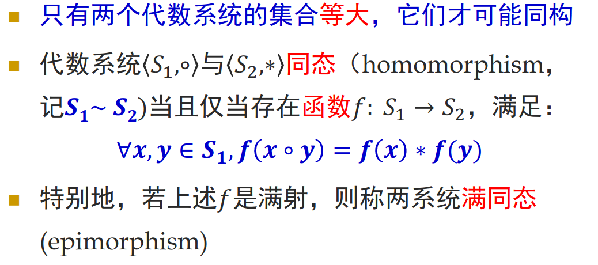

## 群论

### 半群

代数系统 + 结合性 = 半群

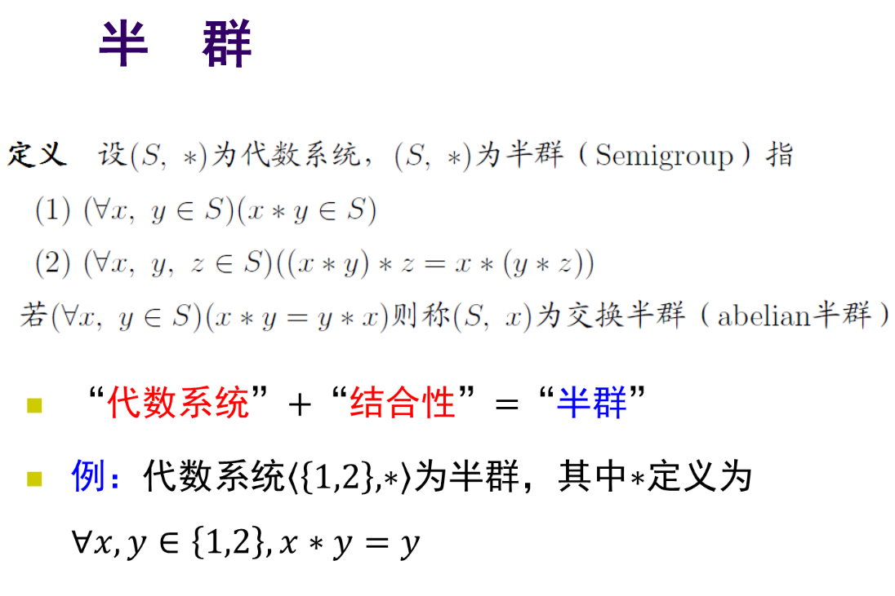

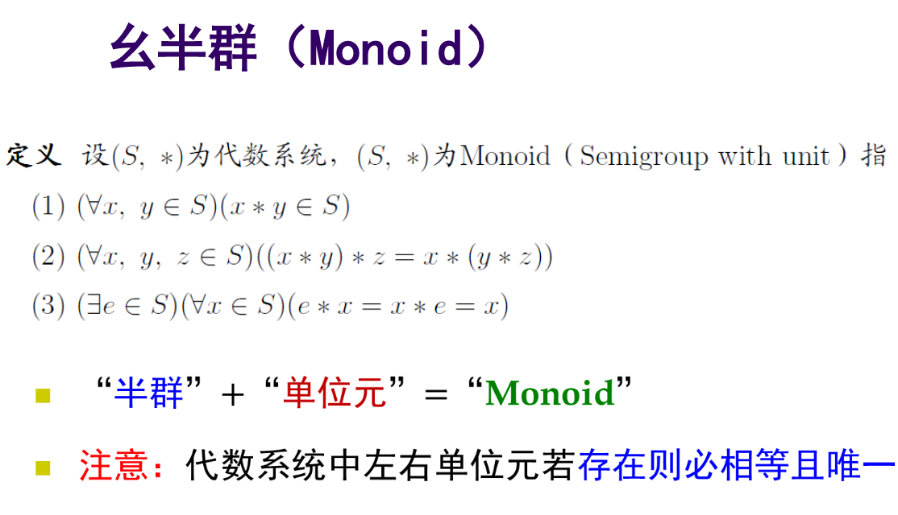

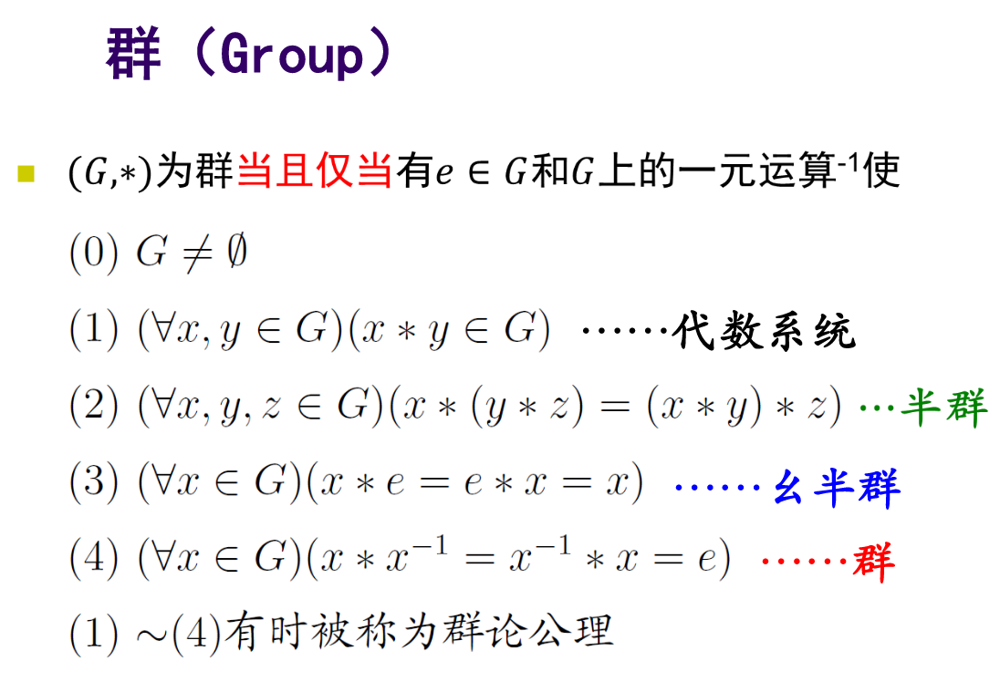

* 封闭性
* 结合性
* 幺元
* 逆元

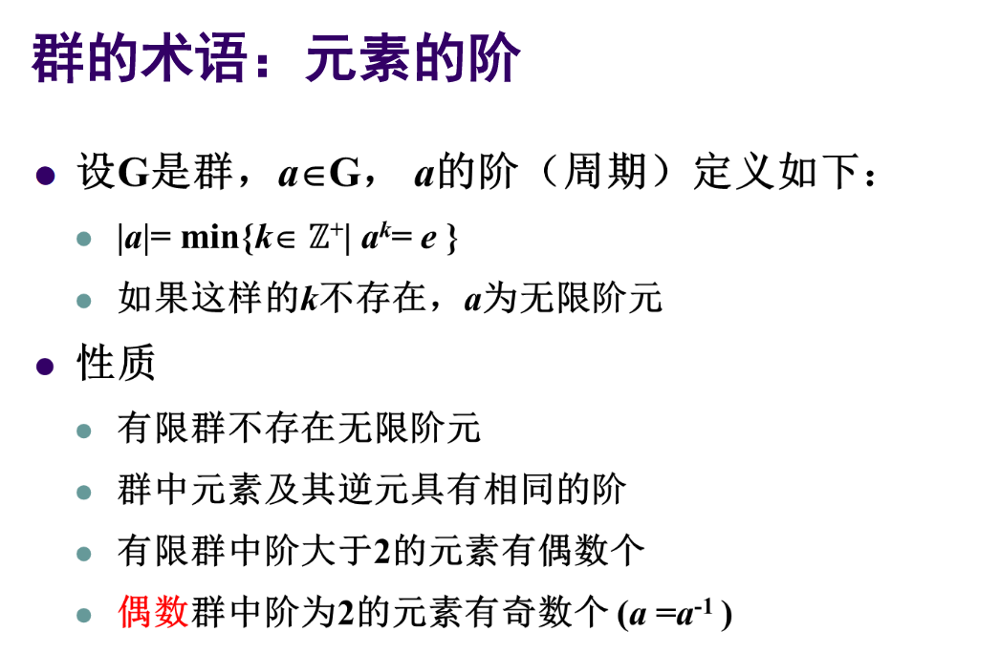

### 子群

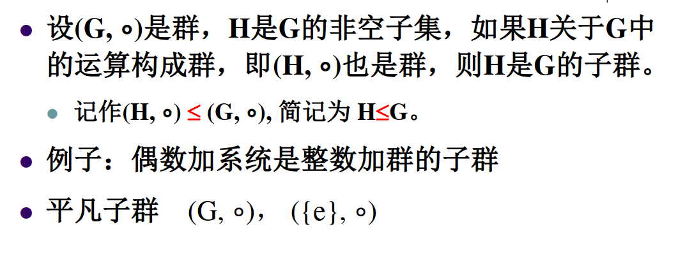

