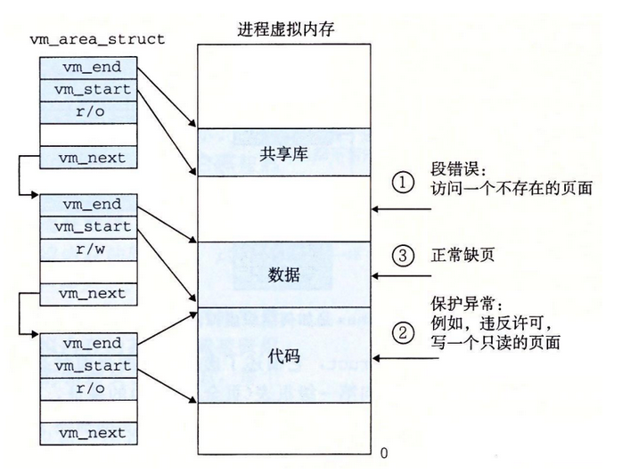

## 内存系统

### 地址空间

**物理地址**：主存被组织成一个数组，每个字节有唯一的地址，这个地址被称为物理地址，存在于物理系统中

**虚拟地址**：现代处理器采用虚拟地址来进行寻址，虚拟地址通过内存管理单元转换为物理地址，虚拟地址一般是线性地址，便于控制

​	MMU：内存管理单元，执行地址转换

虚拟内存与物理内存的联系可以用映射来表达：

### 地址转换

#### 一级页表转换

页表基地址存放在基地址寄存器中，这里存放着页表的位置，输入的虚拟地址部分用来索引页表中的项，其余部分作为偏移量，物理页偏移量一般等于虚拟页偏移量

#### 多级页表

下图为i7 中的四级页表结构，cr3寄存器存储第一级页表位置，通过虚拟地址中的部分地址来索引其余页表位置，其余部分作为偏移量

在i7的机构下，有多级cache存在，如果命中就立即返回，如果没有命中，则向下一级内存进发，如果连主存也没有命中，这只能从硬盘上取了

### Linux 虚拟内存系统

#### linux中的内存组织

linux中的任务结构体包含内存管理块，mm中有第一级页表的偏移，以及按照链表组织的内存段

**代码：**

#### linux中的缺页异常

