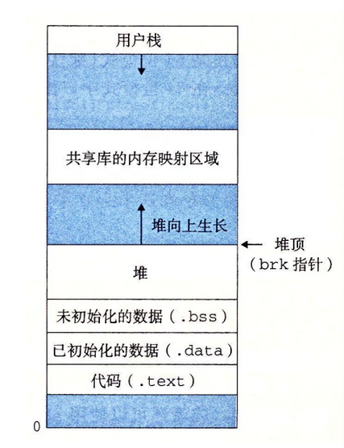
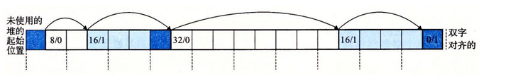
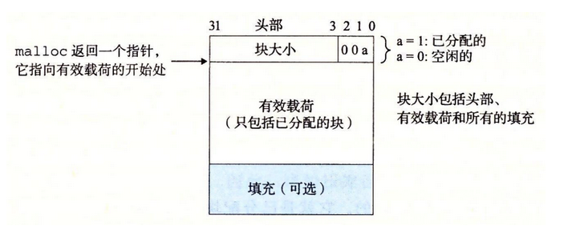
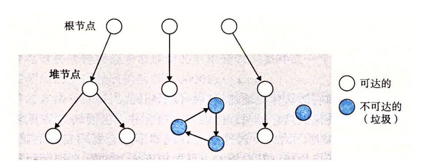

## 虚拟内存高级应用

### 内存映射

内存映射可以实现下面三个功能：

* 共享内存，可以实现进程间通信（共享内存，信箱，管道）

* 写时复制（fork，exec）

* 神奇的加载文件方式（直接映射虚拟内存到文件，然后每一次请求内存都是加载文件，不过我记得linux有交换空间这个东西，不是很明白）以及匿名文件的神奇。**不是很理解**

  

### 动态内存分配

#### 显示分配

c中的malloc与free，c++的new ，delete

本质：维护一个内存链表来完成这些

#### 隐式分配

​									算法：标记，定时清除

**标记**：从每个根节点出发，将后继节点标记，如果没有被标记，那就说明进程死亡了，需要回收

**清除**：何时去free这些内存，有许多调度算法应该。