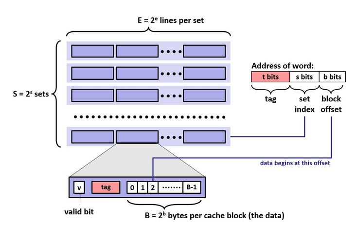
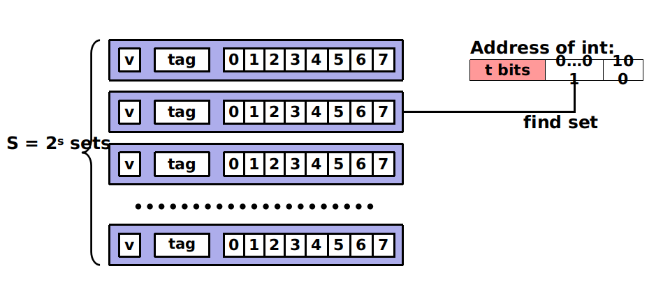
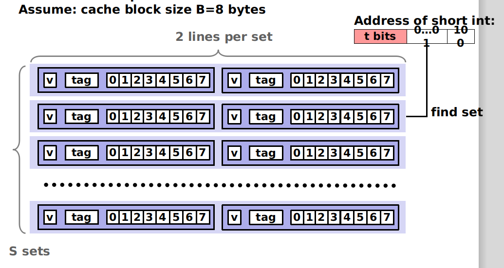
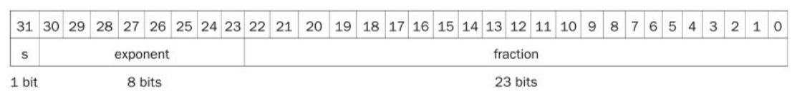
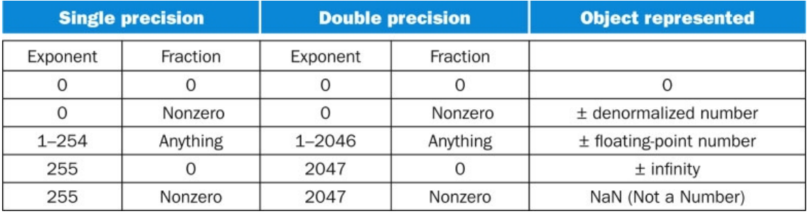

## 知识点

### 小端模式与大端模式

低字节就是最末的字节

小端模式，低字节在低地址

大端模式，低字节在高地址

立即数在指令中也是遵循这样的规律，从左往右

## Cache

利用程序的局部性

利用地址映射到set组中，校验vaild之后，校验tag，成功则命中，否则不命中，进行内存查找，并且进行替换

### 直接映射 Cache

### 两路组相联

### 全相连Cache

挨个比对，复杂度较高，只有一个组

### 浮点数

The number is actually 24 bits long in single precision, and 53 bits long in double precision

#### 溢出

* Overflow: A situation in which a positive exponent becomes too large to fit in the exponent field. x>127 for single
*  Underflow: A situation in which a negative exponent becomes too large to fit the exponent field x<-126 for single

#### 特殊标识

### 为什么用中间bit作为索引？

局部性，如果用前面的bit，则会引起震荡，用后面的bit，不能利用局部性刷新cache

### 练习：

考虑这么一个问题，32 KB大小4路组相连cache，cache line大小是32 Bytes。请思考以下2个问题：

* 多少个组？

* 假设地址宽度是48 bits，index、offset以及tag分别占用几个bit？

总共4路，因此每路大小是8 KB。cache line size是32 Bytes，因此一共有256组（8 KB / 32 Bytes）。由于cache line  size是32  Bytes，所以offset需要5位。一共256组，所以index需要8位，剩下的就是tag部分，占用35位。这个cache可以绘制下图表示。

