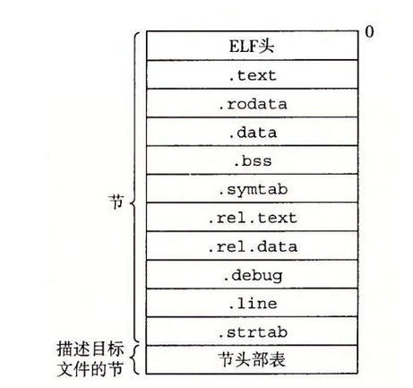
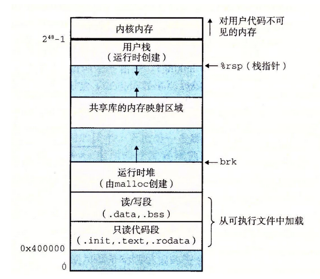
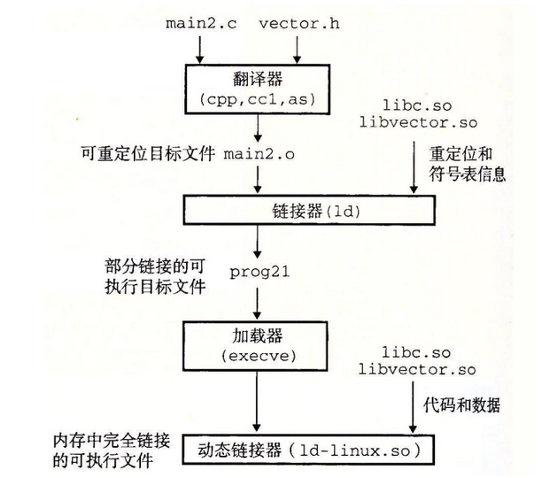
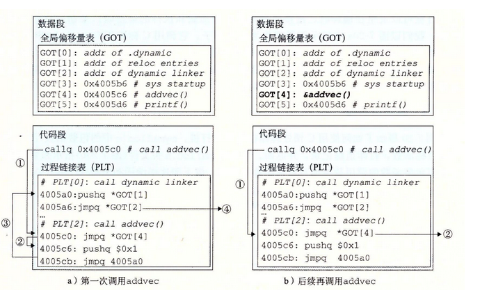

## 链接

#### 可重定位目标文件



可重定向文件由ELF头对文件进行描述，将可重定向文件组进行链接，构成新的可执行文件或者链接库，这个过程中涉及到对ELF头的合并与修改，以及对于多重定义符号的解

**c++ 与 java 的符号重整**：

​		C++ 和 Java 使用兼容的重整策略。一个被重整的类名字是由名字中字符的整数数量，后面跟原始名字组成的。比如，类 Foo 被编码成 3Foo。方法被编码为原始方法名，后面加上 __，加上被重整的类名，再加上每个参数的单字母编码。比如，Foo::bar(int，long) 被编码为 bar__3Fooil。重整全局变量和模板名字的策略是相似的。

#### 加载可执行文件



加载可执行文件过程，由exec系统函数执行，这个过程可以简述为下：

* 解析ELF文件，在linux中，代码段的起始地址在0x400000位置，这个位置可以由链接时对entraypoint位置进行设定
  * 复制代码段
  * 对data段进行内存分配以及初始化
  * 对bss段进行内存分配，初始化为0
  * 映射页表
* 创建进程，设置寄存器保存的值，开始等待调度

#### 静态链接

静态链接的方式：

​		早期为直接把库函数拷贝进可执行文件，这样会使得文件臃肿不堪。

​		后面是对于需要的模块进行拷贝，减少了文件大小，提高了内存使用率

不足：

* 对于库函数无法实现版本更新
* 如果多个文件使用同一个库函数依旧会存在内存冗余的情况

#### 动态链接

动态链接在高性能服务器以及现代操作系统windows中广泛应用，以dll为主的动态链接库，大幅度提升了版本更新的痛苦，而高性能服务器中，可以将动态链接库直接加载到内存中



动态链接早期也会面临静态链接的内存分配冗余的情况

因此引入了**位置无关代码**的思想：



**全局偏移量表GOT**：全局偏移量表GOT是一个记录动态代码地址的数组，默认为对应PLT函数的第二条指令，在GOT表中，GOT[0],GOT[1]是动态加载函数会用到的信息，GOT[2]对应加载函数

**过程链接表PLT**：是一个函数表，这个函数可以理解成是对原来函数的一个封装和控制，封装体现在，这个函数仅仅执行跳转指令，就指向到了原来的库函数，控制体现在，对于这个函数的加载与访问进行控制。其中PLT[0]是加载函数的控制函数，用于参数压栈

##### 第一次调用过程：

- [x] 调用$addvec$过程，进入PLT[1]
- [x] 执行第一条指令，进行跳转
- [x] 根据GOT表的初始化内容，跳转到4005c6（PLT的第二条指令）
- [x] 将对应的控制信息，也就是对应PLT的index压栈
- [x] 跳转到加载函数的控制函数
- [x] 控制函数补充第二个参数，应该是可行的加载地址
- [x] 加载完成，并且将两个参数从栈中pop
- [x] 根据第一个index参数可以计算控制函数跳转位置也就是PLT[1]的第一条指令
- [x] 跳转执行，这是就是后次调用的过程

##### 后次调用过程：

- [x] 调用$addvec$过程，进入PLT[1]
- [x] 执行第一条指令，进行跳转
- [x] 跳转到$addvec$
- [x] ret返回

不足：无关代码机制，基本也是由于c语言的无法动态特性，控制函数数组必然是定长的，也就是有点硬编码的感觉，不过linux的应该可以动态也挺复杂的。

#### 库打桩机制

库打桩机制包含三个类型，发生在程序编译链接的各个阶段：

* 编译时打桩（函数封装）
* 链接时打桩（使用静态链接器，封装 --warp）
* 运行时打桩

##### 运行时打桩

如果 LD_PRELOAD 环境变量被设置为一个共享库路径名的列表（以空格或分号分隔），那么当你加载和执行一个程序，需要解析未定义的引用时，动态链接器（LD-LINUX.SO）会先搜索 LD_PRELOAD 库，然后才搜索任何其他的库。有了这个机制，当你加载和执行任意可执行文件时，可以对任何共享库中的任何函数打桩，包括 libc.so。

**过程**：

- [ ] 设置同名函数
- [ ] 利用linux的动态加载函数，找到真正的库函数
- [ ] 调用真函数或者直接开始破坏

封装函数：

```c++
void free(void *ptr)
{
    void (*freep)(void *) = NULL;
    char *error;

    if (!ptr)
    return;

    freep = dlsym(RTLD_NEXT, "free"); /* Get address of libc free */
    if ((error = dlerror()) != NULL) {
        fputs(error, stderr);
        exit(1);
    }
    freep(ptr); /* Call libc free */
    printf("free(%p)\n", ptr);
}
```

反汇编之后：

```assembly
000000000000122a <free>:
    122a:	f3 0f 1e fa          	endbr64 
    122e:	55                   	push   %rbp
    122f:	48 89 e5             	mov    %rsp,%rbp
    1232:	48 83 ec 20          	sub    $0x20,%rsp
    1236:	48 89 7d e8          	mov    %rdi,-0x18(%rbp)
    123a:	48 c7 45 f0 00 00 00 	movq   $0x0,-0x10(%rbp)
    1241:	00 
    1242:	48 83 7d e8 00       	cmpq   $0x0,-0x18(%rbp)
    1247:	74 71                	je     12ba <free+0x90>
    1249:	48 8d 35 c8 0d 00 00 	lea    0xdc8(%rip),%rsi        # 2018 <_fini+0xd58>
    1250:	48 c7 c7 ff ff ff ff 	mov    $0xffffffffffffffff,%rdi
    1257:	e8 64 fe ff ff       	callq  10c0 <dlsym@plt>
    125c:	48 89 45 f0          	mov    %rax,-0x10(%rbp)
    1260:	e8 6b fe ff ff       	callq  10d0 <dlerror@plt>
    1265:	48 89 45 f8          	mov    %rax,-0x8(%rbp)
    1269:	48 83 7d f8 00       	cmpq   $0x0,-0x8(%rbp)
    126e:	74 23                	je     1293 <free+0x69>
    1270:	48 8b 05 81 2d 00 00 	mov    0x2d81(%rip),%rax        # 3ff8
```

运行：

```shell
linux> LD_PRELOAD="./myfree.so" ./intr
free(0x1bf7010)
```


