[TOC]

## 极限

设有某个数列，当n无限增大的时候，$X_n$ 无限趋近于某个确定的常数$a$, 记作：

$\lim_{x\to \inf} = a$

this is also called this array is converge to a, otherwise this array is divergence

### 有界性 与收敛性

* 收敛一定有界
* 有界不一定收敛

### 极限的运算法则

$\lim_{n \to \inf} X_n = A, \lim_{n \to \inf} Y_n = B$

* $\lim _{n \to \inf} (X_n + Y_n) = A+ B$
* $\lim _{n \to \inf} (X_n - Y_n) = A - B$
* $\lim _{n \to \inf} (X_n * Y_n) = A* B$
* $\lim _{n \to \inf} ({X_n \over Y_n}) = {A\over B}$
* $\lim _{n \to \inf} (\lambda X_n + \beta Y_n) = \lambda A+ \beta B$

### 极限存在的两个准则

* 夹逼准则
* 单调有界准则

### 两个重要极限

$\lim_{x \to 0} {sinx \over x} = 1$

$\lim_{x \to 0} (1+x)^{1\over x} = e $

### 无穷小的概念

* 无穷小与有界函数的乘积仍为无穷小
* 无穷小除以具有非零极限的函数所得的商仍为无穷小

## 微分中值定理

### 罗尔中值定理

* 闭区间$[a,b]$连续，开区间$(a,b)$可导
* $f(a) = f(b)$

在 $(a,b)$内，至少存在一点$\sigma$, $f^1(\sigma) = 0$

### 拉格朗日中值定理

* 闭区间$[a,b]$连续，开区间$(a,b)$可导

在 $(a,b)$内，至少存在一点$\sigma$,  $f^1(\sigma) = {f(a) - f(b) \over a-b}$

### 柯西中值定理

* $F(x), f(x)$ 闭区间$[a,b]$连续，开区间$(a,b)$可导
* $F^1(x) \neq 0$

在 $(a,b)$内，至少存在一点$\sigma$,  ${f^1(\sigma) \over F^1(\sigma)} = {f(a) - f(b) \over F(a)-F(b)}$

### 泰勒公式

* 带有皮亚诺余项的泰勒展开公式
* 带有拉格朗日余项的泰勒展开公式

## 不定积分

* 换元积分法
* 分部积分法
* 公式积分法

## 定积分与其应用

* 换元积分法
* 分部积分法

### 广义积分

## 向量代数与空间解析几何

## 多元函数微分法

### 多元函数的极限

在领域内，通过不同路径去趋近，如果结果相同，就有极限存在

### 多元函数的连续性

### 偏导数

偏导不一定连续

连续不一定偏导

### 全微分

可微一定可偏导

可微一定连续

### 方向导数（scalar）

偏导数只有正方向，方向导数有正负方向

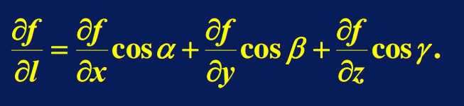

### 梯度（tensor）

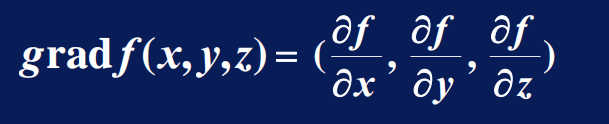

## 重积分

* 二重积分 和 二次积分

二重积分的对象是小面积块，是二维对象

二次积分的对象是多个一维变量

二重积分可以化为二次积分求解

## 曲线积分

* 第一类曲线积分
* 第二类曲线积分（向量）

### 格林公式

平面到曲线

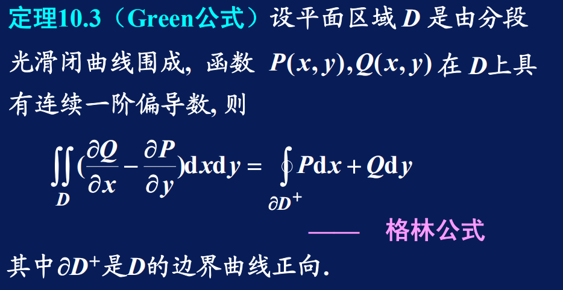

## 曲面积分

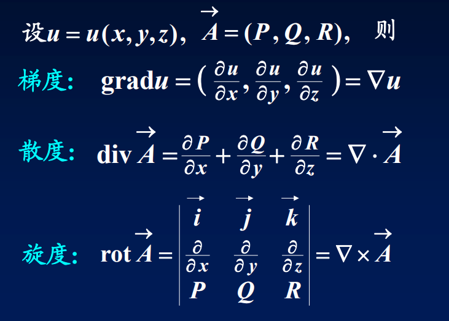

### 高斯公式

对通量的面积分等价于对散度的体积分

* 散度

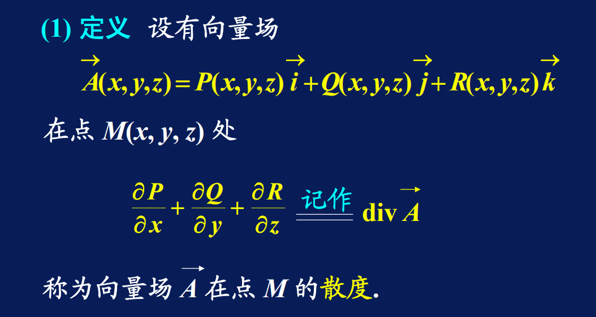

* 通量

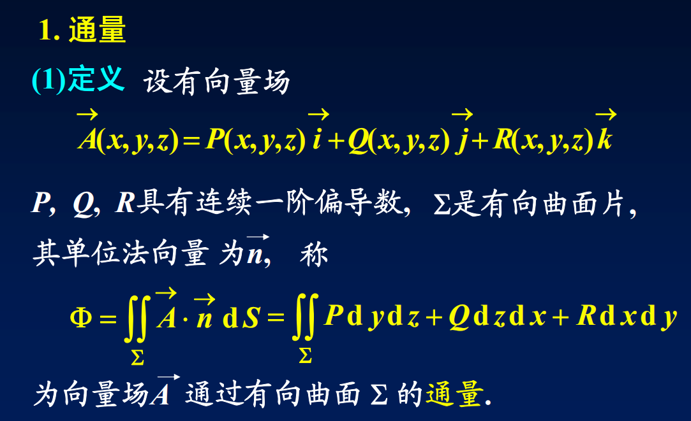

公式：

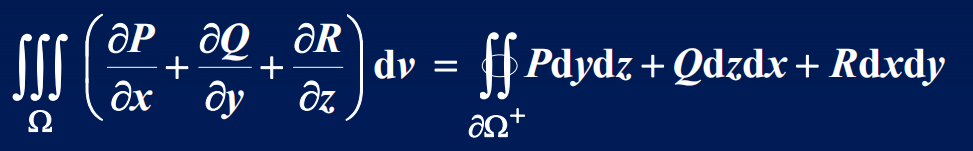

### 斯托克斯公式

* 环量

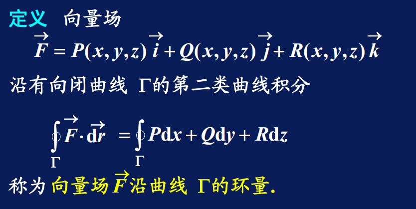

* 旋度

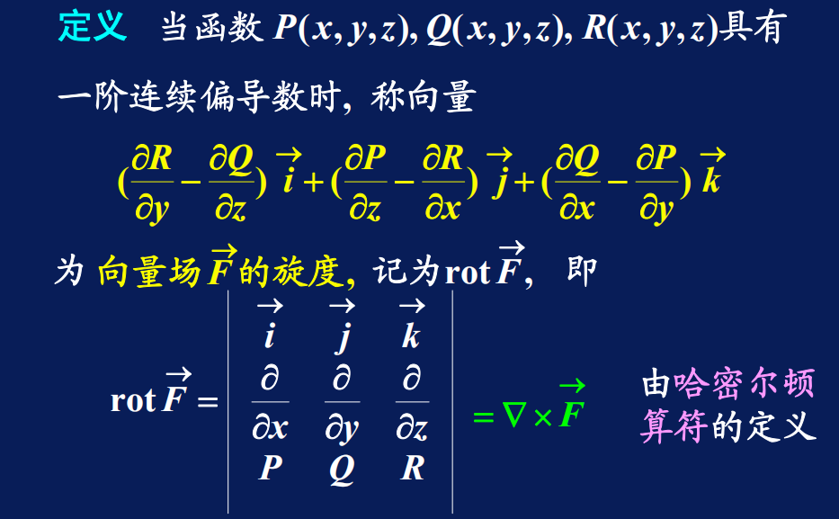

公式：

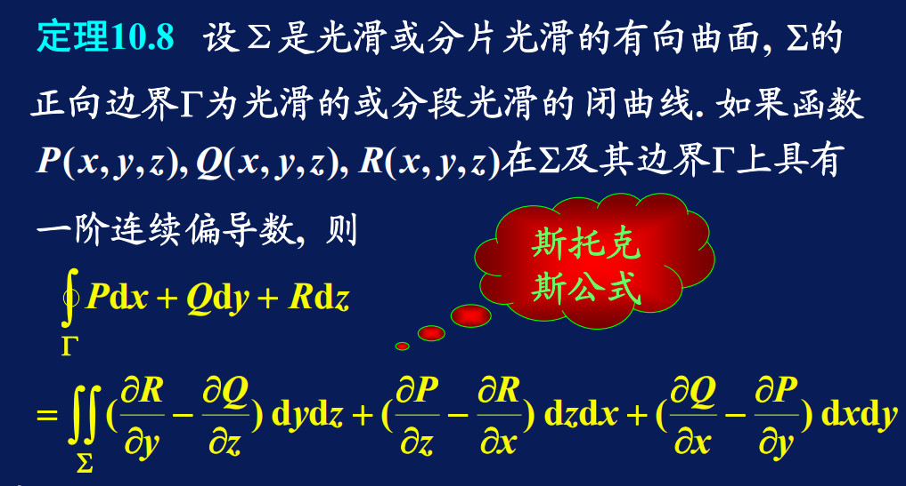

## 无穷级数

### 正交函数系

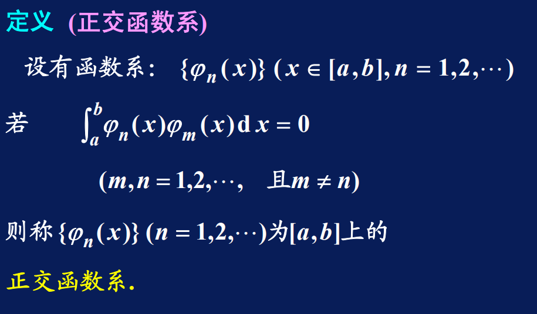

